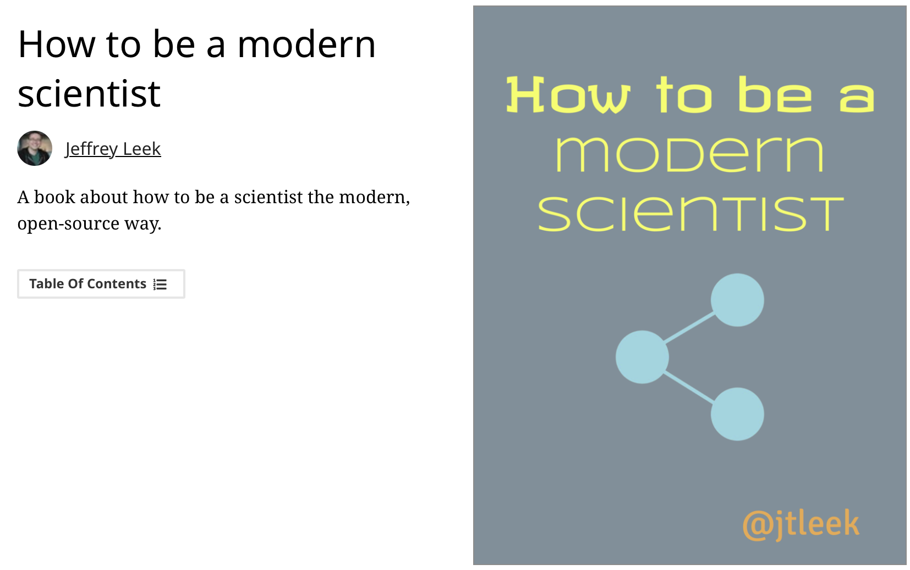
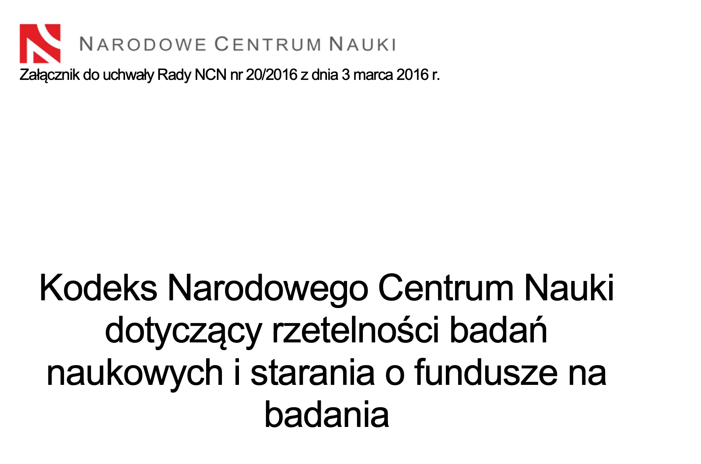

# Metodologia badań psychologicznych

Wykłady, semestr letni

Krzysztof Basiński

---

# Kontakt

* E-mail: k.basinski@gumed.edu.pl
* kbas.gumed.edu.pl
* kbas.gumed.edu.pl/mbp

---

# Organizacja

* Wykłady (KB) we wtorki, 16:45 - 18:15 cały semestr
* Ćwiczenia (NN)

---

# Warunki zaliczenia

* 2 kolokwia na Moodlu
* Dodatkowe  punkty za ogólną bystrość
* 25% wszystkich punktów z metodologii
* Jeżeli z kolokwiów nie uzyskacie w sumie min. 60% punktów, będzie kolokwium poprawkowe z materiału z całego semestru, tzw. zbój. 
* **Opłaca się zaliczyć koła w pierwszych terminach, ponieważ zbój nie kasuje Waszych poprzednich podejść!** 
* Za zbója będzie moża uzyskać dokładnie tyle samo punktów, co za oba kolokwia razem, a wyniki kolokwiów i zbója będą się sumować i na tej podstawie będą przyznawane punkty do końcowej oceny z przedmiotu. 

---

# Egzamin

* Wszyscy, ktorzy zaliczą zajęcia w systemie punktowym będą **zwolnieni z egzaminu**, z oceną, która wynika z opisanego systemu punktowego. 
* Egzamin będzie trudny i będzie miał charakter **bardzo groźnego zbója**. Będzie obejmował treści, które pojawiły się na ćwiczeniach, laboratoriach i wykładach **przez cały rok**.
* Możesz podejść do egzaminu jeśli jesteś niezadowolony(a) ze swojej oceny. Jednak jeżeli podejdziesz, twoja końcowa ocena z przedmiotu to **ocena z egzaminu** (jakakolwiek by nie była). Ryzyk fizyk.

---

# Podręczniki

---

# Podręczniki

---

# Podręczniki

---

# Podręczniki

---

# Proces badawczy - powtórzenie

---

# Etyka badań naukowych

---

# Etyka w badaniach

* Przestrzeganie kodeksów etycznych
* Unikanie plagiatów i auto-plagiatów
* Problemy świadomej zgody
* Etyczne raportowanie wyników badań
* Przechowywanie i dzielenie się danymi „surowymi”
* Problem dublowania publikacji i dzielenia ich na części

---

# Plagiat w kodeksie NCN

Plagiat polega na przywłaszczeniu sobie autorstwa całości lub części cudzego utworu w rozumieniu przepisów ustawy z dnia 4 lutego 1994r. o prawie autorskim i prawach pokrewnych. W szerszym rozumieniu plagiatem jest również przypisywanie sobie cudzych idei, wyników lub określeń bez właściwego odniesienia do nazwiska twórcy, a także nieautoryzowane wykorzystanie informacji uzyskanych w trakcie poufnego recenzowania wniosków i manuskryptów

---

# Więcej o plagiatach

<https://usosweb.uksw.edu.pl/instrukcje/Praktyczny_przewodnik_antyplagiatowy_NKohtamaki.pdf>
<https://pl.wikipedia.org/wiki/Plagiat>

---

# Kodeksy etyczne

- Kodeks PTP
- Kodeks APA
- Kodeks NCN

---

# Kodeks PTP

Jest nowy! 2018 rok. 

---

12.3. Praktyka oparta na wynikach badań naukowych
12.3.a. Ze względu na naukowy charakter podstaw praktyki zawodowej, psycholog dysponuje aktualną i adekwatnie szeroką wiedzą z dziedziny psychologii jako dyscypliny naukowej. Posiada aktualną i możliwie jak najszerszą wiedzę związaną z obraną przez siebie specjalnością, w szczególności wiedzę wykraczającą poza obszar akademickiego kształcenia podstawowego.
12.3.b. Psycholog wykorzystuje w praktyce zawodowej metody posiadające wystarczające podstawy naukowe i nie stosuje metod, których skuteczność została podważona przez badania naukowe. Psycholog potrafi uzasadnić swoje stanowisko w sprawach zawodowych, odnosząc się do wiedzy naukowej.

---

# Kodeks APA - Standardy

---

8.01 Institutional Approval 

When institutional approval is required, psychologists provide accurate information about their research proposals and obtain approval prior to conducting the research. They conduct the research in accordance with the approved research protocol.

---

8.02 Informed Consent to Research 

(a) When obtaining informed consent as required in Standard 3.10, Informed Consent, psychologists inform participants about (1) the purpose of the research, expected duration, and procedures; (2) their right to decline to participate and to withdraw from the research once participation has begun; (3) the foreseeable consequences of declining or withdrawing; (4) reasonably foreseeable factors that may be expected to influence their willingness to participate such as potential risks, discomfort, or adverse effects; (5) any prospective research benefits; (6) limits of confidentiality; (7) incentives for participation; and (8) whom to contact for questions about the research and research participants' rights. They provide opportunity for the prospective participants to ask questions and receive answers. (See also Standards 8.03, Informed Consent for Recording Voices and Images in Research; 8.05, Dispensing with Informed Consent for Research; and 8.07, Deception in Research.)

---

(b) Psychologists conducting intervention research involving the use of experimental treatments clarify to participants at the outset of the research (1) the experimental nature of the treatment; (2) the services that will or will not be available to the control group(s) if appropriate; (3) the means by which assignment to treatment and control groups will be made; (4) available treatment alternatives if an individual does not wish to participate in the research or wishes to withdraw once a study has begun; and (5) compensation for or monetary costs of participating including, if appropriate, whether reimbursement from the participant or a third-party payor will be sought. (See also Standard 8.02a, Informed Consent to Research.)

---

8.03 Informed Consent for Recording Voices and Images in Research 

Psychologists obtain informed consent from research participants prior to recording their voices or images for data collection unless (1) the research consists solely of naturalistic observations in public places, and it is not anticipated that the recording will be used in a manner that could cause personal identification or harm, or (2) the research design includes deception, and consent for the use of the recording is obtained during debriefing. (See also Standard 8.07, Deception in Research.)

---

8.04 Client/Patient, Student, and Subordinate Research Participants 

(a) When psychologists conduct research with clients/patients, students, or subordinates as participants, psychologists take steps to protect the prospective participants from adverse consequences of declining or withdrawing from participation.
(b) When research participation is a course requirement or an opportunity for extra credit, the prospective participant is given the choice of equitable alternative activities.

---

8.05 Dispensing with Informed Consent for Research 

Psychologists may dispense with informed consent only (1) where research would not reasonably be assumed to create distress or harm and involves (a) the study of normal educational practices, curricula, or classroom management methods conducted in educational settings; (b) only anonymous questionnaires, naturalistic observations, or archival research for which disclosure of responses would not place participants at risk of criminal or civil liability or damage their financial standing, employability, or reputation, and confidentiality is protected; or (c) the study of factors related to job or organization effectiveness conducted in organizational settings for which there is no risk to participants' employability, and confidentiality is protected or (2) where otherwise permitted by law or federal or institutional regulations.

---

8.06 Offering Inducements for Research Participation 

(a) Psychologists make reasonable efforts to avoid offering excessive or inappropriate financial or other inducements for research participation when such inducements are likely to coerce participation.
(b) When offering professional services as an inducement for research participation, psychologists clarify the nature of the services, as well as the risks, obligations, and limitations. (See also Standard 6.05, Barter with Clients/Patients.)

---

8.07 Deception in Research 

(a) Psychologists do not conduct a study involving deception unless they have determined that the use of deceptive techniques is justified by the study's significant prospective scientific, educational, or applied value and that effective nondeceptive alternative procedures are not feasible.
(b) Psychologists do not deceive prospective participants about research that is reasonably expected to cause physical pain or severe emotional distress.
(c) Psychologists explain any deception that is an integral feature of the design and conduct of an experiment to participants as early as is feasible, preferably at the conclusion of their participation, but no later than at the conclusion of the data collection, and permit participants to withdraw their data. (See also Standard 8.08, Debriefing.)

---

8.08 Debriefing 

(a) Psychologists provide a prompt opportunity for participants to obtain appropriate information about the nature, results, and conclusions of the research, and they take reasonable steps to correct any misconceptions that participants may have of which the psychologists are aware.
(b) If scientific or humane values justify delaying or withholding this information, psychologists take reasonable measures to reduce the risk of harm.
(c) When psychologists become aware that research procedures have harmed a participant, they take reasonable steps to minimize the harm.

---

8.09 Humane Care and Use of Animals in Research 

(a) Psychologists acquire, care for, use, and dispose of animals in compliance with current federal, state, and local laws and regulations, and with professional standards.
(b) Psychologists trained in research methods and experienced in the care of laboratory animals supervise all procedures involving animals and are responsible for ensuring appropriate consideration of their comfort, health, and humane treatment.
(c) Psychologists ensure that all individuals under their supervision who are using animals have received instruction in research methods and in the care, maintenance, and handling of the species being used, to the extent appropriate to their role. (See also Standard 2.05, Delegation of Work to Others.)

---

(d) Psychologists make reasonable efforts to minimize the discomfort, infection, illness, and pain of animal subjects.
(e) Psychologists use a procedure subjecting animals to pain, stress, or privation only when an alternative procedure is unavailable and the goal is justified by its prospective scientific, educational, or applied value.
(f) Psychologists perform surgical procedures under appropriate anesthesia and follow techniques to avoid infection and minimize pain during and after surgery.
(g) When it is appropriate that an animal's life be terminated, psychologists proceed rapidly, with an effort to minimize pain and in accordance with accepted procedures.

---

8.10 Reporting Research Results 

(a) Psychologists do not fabricate data. (See also Standard 5.01a, Avoidance of False or Deceptive Statements.)
(b) If psychologists discover significant errors in their published data, they take reasonable steps to correct such errors in a correction, retraction, erratum, or other appropriate publication means.

---

8.11 Plagiarism 

Psychologists do not present portions of another's work or data as their own, even if the other work or data source is cited occasionally.

---

8.12 Publication Credit 

(a) Psychologists take responsibility and credit, including authorship credit, only for work they have actually performed or to which they have substantially contributed. (See also Standard 8.12b, Publication Credit.)
(b) Principal authorship and other publication credits accurately reflect the relative scientific or professional contributions of the individuals involved, regardless of their relative status. Mere possession of an institutional position, such as department chair, does not justify authorship credit. Minor contributions to the research or to the writing for publications are acknowledged appropriately, such as in footnotes or in an introductory statement.
(c) Except under exceptional circumstances, a student is listed as principal author on any multiple-authored article that is substantially based on the student's doctoral dissertation. Faculty advisors discuss publication credit with students as early as feasible and throughout the research and publication process as appropriate. (See also Standard 8.12b, Publication Credit.)

---

8.13 Duplicate Publication of Data 
Psychologists do not publish, as original data, data that have been previously published. This does not preclude republishing data when they are accompanied by proper acknowledgment.

---

8.14 Sharing Research Data for Verification 
(a) After research results are published, psychologists do not withhold the data on which their conclusions are based from other competent professionals who seek to verify the substantive claims through reanalysis and who intend to use such data only for that purpose, provided that the confidentiality of the participants can be protected and unless legal rights concerning proprietary data preclude their release. This does not preclude psychologists from requiring that such individuals or groups be responsible for costs associated with the provision of such information.
(b) Psychologists who request data from other psychologists to verify the substantive claims through reanalysis may use shared data only for the declared purpose. Requesting psychologists obtain prior written agreement for all other uses of the data.

---

8.15 Reviewers 

Psychologists who review material submitted for presentation, publication, grant, or research proposal review respect the confidentiality of and the proprietary rights in such information of those who submitted it.

---

# Kodeks NCN

---

# Kodeks NCN - dbałość o rzetelność naukową

Dbałość o rzetelność naukową:
1. Broni podwalin nauki jako takiej;
2. Pomaga zachować zaufanie opinii publicznej do naukowców i danych naukowych;
3. Stanowi podstawę dla dalszego przeznaczania środków publicznych na badania naukowe;
4. Chroni reputację badaczy i ma wymierne znaczenie dla ich kariery;
5. Zapobiega negatywnym wpływom badań naukowych na pacjentów i społeczeństwo;
6. Przyczynia się do rozwoju ekonomicznego;
7. Zapobiega marnowaniu środków przeznaczanych na badania naukowe.
