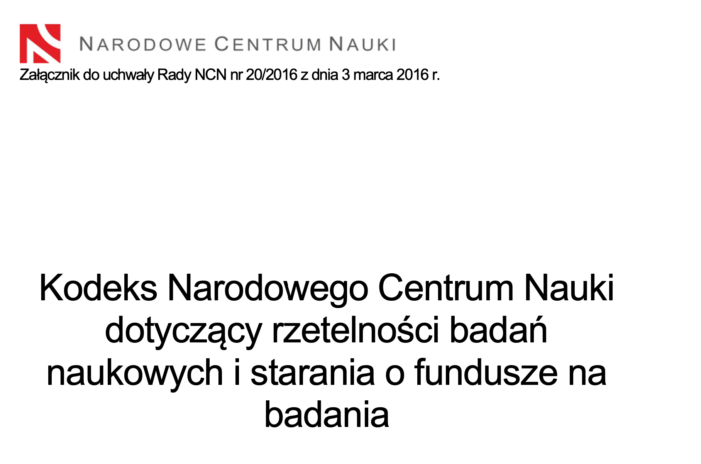
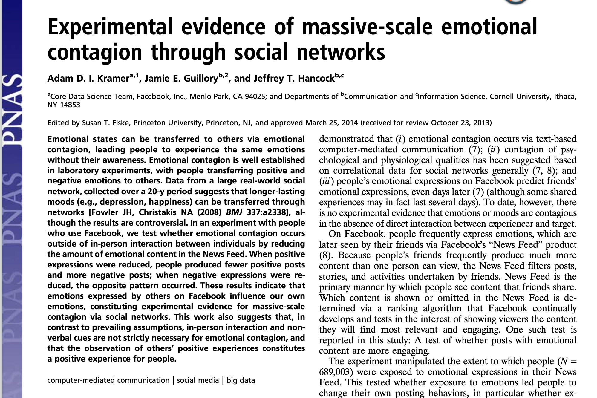
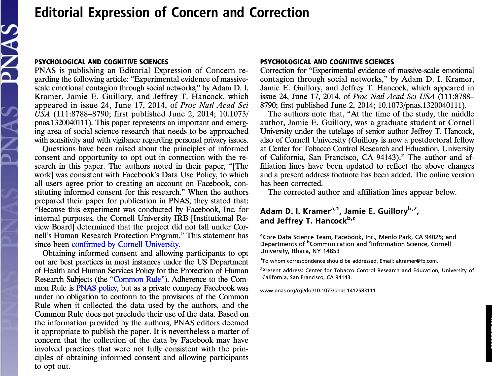

# Etyka w badaniach, cz. 2

---

8.07 Deception in Research 

(a) Psychologists do not conduct a study involving deception unless they have determined that the use of deceptive techniques is justified by the study's significant prospective scientific, educational, or applied value and that effective nondeceptive alternative procedures are not feasible.
(b) Psychologists do not deceive prospective participants about research that is reasonably expected to cause physical pain or severe emotional distress.
(c) Psychologists explain any deception that is an integral feature of the design and conduct of an experiment to participants as early as is feasible, preferably at the conclusion of their participation, but no later than at the conclusion of the data collection, and permit participants to withdraw their data. (See also Standard 8.08, Debriefing.)

---

8.08 Debriefing 

(a) Psychologists provide a prompt opportunity for participants to obtain appropriate information about the nature, results, and conclusions of the research, and they take reasonable steps to correct any misconceptions that participants may have of which the psychologists are aware.
(b) If scientific or humane values justify delaying or withholding this information, psychologists take reasonable measures to reduce the risk of harm.
(c) When psychologists become aware that research procedures have harmed a participant, they take reasonable steps to minimize the harm.

---

8.09 Humane Care and Use of Animals in Research 

(a) Psychologists acquire, care for, use, and dispose of animals in compliance with current federal, state, and local laws and regulations, and with professional standards.
(b) Psychologists trained in research methods and experienced in the care of laboratory animals supervise all procedures involving animals and are responsible for ensuring appropriate consideration of their comfort, health, and humane treatment.
(c) Psychologists ensure that all individuals under their supervision who are using animals have received instruction in research methods and in the care, maintenance, and handling of the species being used, to the extent appropriate to their role. (See also Standard 2.05, Delegation of Work to Others.)

---

(d) Psychologists make reasonable efforts to minimize the discomfort, infection, illness, and pain of animal subjects.
(e) Psychologists use a procedure subjecting animals to pain, stress, or privation only when an alternative procedure is unavailable and the goal is justified by its prospective scientific, educational, or applied value.
(f) Psychologists perform surgical procedures under appropriate anesthesia and follow techniques to avoid infection and minimize pain during and after surgery.
(g) When it is appropriate that an animal's life be terminated, psychologists proceed rapidly, with an effort to minimize pain and in accordance with accepted procedures.

---

8.10 Reporting Research Results 

(a) Psychologists do not fabricate data. (See also Standard 5.01a, Avoidance of False or Deceptive Statements.)
(b) If psychologists discover significant errors in their published data, they take reasonable steps to correct such errors in a correction, retraction, erratum, or other appropriate publication means.

---

8.11 Plagiarism 
Psychologists do not present portions of another's work or data as their own, even if the other work or data source is cited occasionally.

---

8.12 Publication Credit 

(a) Psychologists take responsibility and credit, including authorship credit, only for work they have actually performed or to which they have substantially contributed. (See also Standard 8.12b, Publication Credit.)
(b) Principal authorship and other publication credits accurately reflect the relative scientific or professional contributions of the individuals involved, regardless of their relative status. Mere possession of an institutional position, such as department chair, does not justify authorship credit. Minor contributions to the research or to the writing for publications are acknowledged appropriately, such as in footnotes or in an introductory statement.
(c) Except under exceptional circumstances, a student is listed as principal author on any multiple-authored article that is substantially based on the student's doctoral dissertation. Faculty advisors discuss publication credit with students as early as feasible and throughout the research and publication process as appropriate. (See also Standard 8.12b, Publication Credit.)

---

8.13 Duplicate Publication of Data 
Psychologists do not publish, as original data, data that have been previously published. This does not preclude republishing data when they are accompanied by proper acknowledgment.

---

8.14 Sharing Research Data for Verification 
(a) After research results are published, psychologists do not withhold the data on which their conclusions are based from other competent professionals who seek to verify the substantive claims through reanalysis and who intend to use such data only for that purpose, provided that the confidentiality of the participants can be protected and unless legal rights concerning proprietary data preclude their release. This does not preclude psychologists from requiring that such individuals or groups be responsible for costs associated with the provision of such information.
(b) Psychologists who request data from other psychologists to verify the substantive claims through reanalysis may use shared data only for the declared purpose. Requesting psychologists obtain prior written agreement for all other uses of the data.

---

8.15 Reviewers 

Psychologists who review material submitted for presentation, publication, grant, or research proposal review respect the confidentiality of and the proprietary rights in such information of those who submitted it.

---

# Kodeks NCN

---

# Kodeks NCN - dbałość o rzetelność naukową

Dbałość o rzetelność naukową:
1. Broni podwalin nauki jako takiej;
2. Pomaga zachować zaufanie opinii publicznej do naukowców i danych naukowych;
3. Stanowi podstawę dla dalszego przeznaczania środków publicznych na badania naukowe;
4. Chroni reputację badaczy i ma wymierne znaczenie dla ich kariery;
5. Zapobiega negatywnym wpływom badań naukowych na pacjentów i społeczeństwo;
6. Przyczynia się do rozwoju ekonomicznego;
7. Zapobiega marnowaniu środków przeznaczanych na badania naukowe.

---

# Nieetyczne badania w psychologii - Hall of Fame

---

# Eksperyment Milgrama

---

# Stanfordzki eksperyment więzienny Zimbardo

---

# The Aversion Project - Aubrey Levin

* RPA, apartheid
* Uczestnicy - homoseksualni żołnierze (ok. 900 objętych programem)
* Przymusowe elektrowstrząsy i terapia awersyjna
* Po zakończeniu apartheidu sam dr Levin wyemigrował do Kanady, gdzie praktykował jako psychiatra
* Został nawet profesorem na University of Calgary aż do 2013 roku gdy... został skazany za molestowanie seksualne swoich 30 pacjentów (mężczyzn!)

---

# The Monster Study (1939)

* Werbalne znęcanie się nad dziećmi jąkającymi się
* Dzieci "zdrowe" po procedurze eksperymentalnej zaczęły się jąkać

---

# Dziś wciąż robi się nieetyczne badania

---

---

