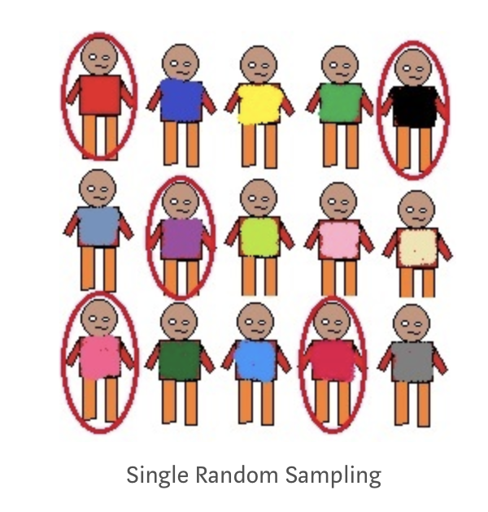
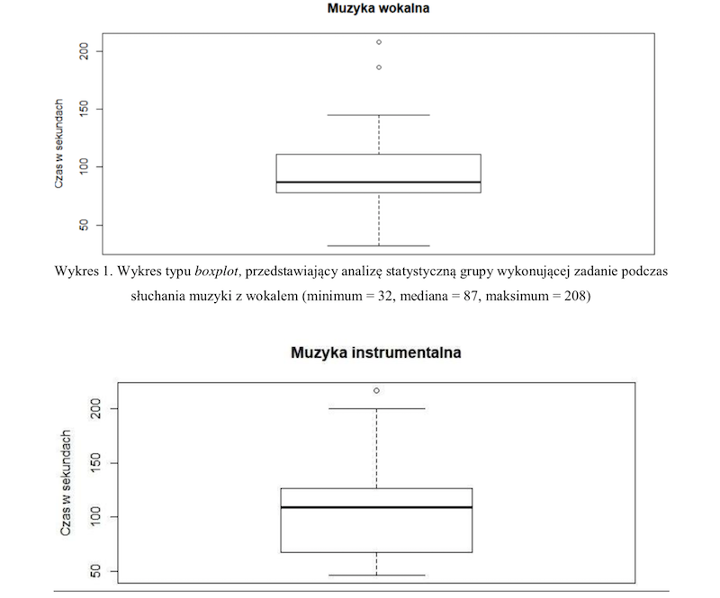

# Podstawy filozofii nauki


## Psychologia jako nauka
- Psycholog polega na badaniach empirycznych w wyciąganiu wniosków nt. zachowania ludzi
- Badania empiryczne oparte są na danych zbieranych i analizowanych w systematyczny sposób
- Zasady regulujące w jaki sposób naukowcy zbierają i analizują dane zbiorczo nazywane są metodą naukową


## Prawa i teorie
- Twierdzenia ogólne, stosowane do wszystkich sytuacji w danej dziedzinie, to prawa
- W fizyce np.:
    - Zasady dynamiki Newtona
    - Prawo powszechnego ciążenia
    - Ogólna i szczególna teoria względności
- W psychologii:
    - Prawo Webera-Fechnera
    - Prawo Yerksa-Dodsona
    - Prawo efektu (Thorndike)
- Teoria naukowa – zestaw reguł, które wyjaśniają i pozwalają przewidywać wiele (lecz nie wszystkie) zjawiska w jakiejś dziedzinie
- W psychologii np.:
    - Teoria społecznego uczenia się
    - Teoria rozwoju poznawczego Piageta
    - Teoria przeniesienia pobudzenia emocjonalnego
    - Teoria salutogenetyczna Antonovskiego
    - …i SETKI innych mniejszych/większych teorii


## Warunki dobrej teorii naukowej (za Stangorem ale nie tylko)
Dobra teoria naukowa powinna:

1. Być ogólna
2. Być oszczędna
3. Stymulować dalsze badania
4. Być falsyfikowalna


## Falsyfikacjonizm
- Karl Popper, Austria/UK, I poł. XXw.
- Teoria jest naukowa wtedy, gdy istnieje *hipotetyczna możliwość dowiedzenia jej nieprawdziwości*
- Np. teoria „wszystkie łabędzie są białe” jest falsyfikowalna.


## Teorie falsyfikowalne


## Teorie problematyczne


## Prcaca naukowa jako weryfikowanie hipotez
- Empirycznej weryfikacji teorii dokonuje się poprzez weryfikowanie hipotez wysnutych na jej podstawie
- Hipoteza – proponowane wyjaśnienie jakiegoś zjawiska, sformułowane na podstawie teorii naukowej i testowalne przy pomocy badań empirycznych
- Hipoteza najczęściej postuluje jakiś związek pomiędzy zmiennymi
- Jeśli hipotezy wysnute z teorii potwierdzane są w badaniach, to teoria jest dobrą teorią naukową…
- …ale…


## Nauka z perspektywy kurczaków czyli problem indukcji
- Kurczak co rano obserwuje jak hodowca przychodzi i wydaje jedzenie
- Na mocy indukcji kurczak stwierdza, iż prawdziwe jest zdanie „hodowca każdego dnia przychodzi wydać jedzenie”
- Problem – pewnego dnia hodowca przychodzi i ukręca łeb kurczakowi
- Inne przykłady:
    - Każdego dnia wschodzi słońce
    - Jeśli ktoś umiera, to nigdy nie jestem to ja.
- Czy można orzec o prawdziwości teorii na podstawie danych empirycznych, które ją potwierdzają?


## Inny sposób na poradzenie sobie z problemem indukcji
- To co otrzymujemy na drodze indukcji to nie dowód na prawdziwość teorii tylko jej uprawdopodobnienie
- Teorie naukowe w kategoriach probabilistycznych
- Problem filozoficzny (D.Hume) – nie ma logicznego uzasadnienia dla przewidywania przyszłości tylko na podstawie wydarzeń z przeszłości


## Jeszcze inny sposób na poradzenie sobie z problemem indukcji
- Nauka składa się z tzw. rozumowań abdukcyjnych
- Podział rozumowań:
    - Dedukcyjne – wnioskowanie o konkluzjach na podstawie logicznych przesłanek
        - Prawo sylogizmu - jeśli A->B i  B->C to A->C
        - np.: Wszyscy ludzie są śmiertelni. Elvis Presley jest człowiekiem. Elvis Presley jest śmiertelny.
    - Indukcyjne
    - Abdukcyjne – obserwujemy zjawisko i poszukujemy jego wyjaśnienia (rozumowanie post hoc)
    
    
## Rozumowania abdukcyjne
- W trakcie gry w bilard obserwujemy poruszającą się czarną bilę 
- Możemy założyć, że porusza się ona, ponieważ została uderzona przez białą bilę. Nie jest to zawsze prawdziwe założenie, ale pozwala nam orientować się w danym zjawisku
- Naukowcy formułują jedynie prawdopodobne hipotezy na temat świata 
- Hipotez może być wiele – problem brzytwy Ockhama


## Brzytwa Ockhama
- **Spośród konkurencyjnych hipotez, wybrana powinna być ta z najmniejszą ilością założeń**
- Przykład: w czasach Kopernika obserwacje ciał niebieskich można było wytłumaczyć zarówno modelem helio-, jak i geocentrycznym. Model geocentryczny wymagał jednak bardzo wielu założeń a heliocentryczny tylko siedmiu
- Często Brzytwa jest nadinterpretowana – *„najprostsze wyjaśnienie jest najlepsze”* (!)
- A.Einstein: *„wszystko powinno być opisane tak prosto jak to tylko możliwe… ale nie prościej!”*


## Rozwój nauki - paradygmaty (Thomas Kuhn)

- Thomas Samuel Kuhn (1922-1996), amerykański fizyk, historyk, filozof nauki, autor książki The Structure of Scientific Revolutions (1962)
- Wcześniej sądzono, że rozwój nauki przebiega poprzez akumulację wiedzy
- Kuhn dowodzi, że w nauce dochodzi do rewolucji, zwanych zmianami paradygmatów (paradigm shift)
- Paradygmat to ogólnie uznawany (w danym momencie) model problemów i rozwiązań, który dla grupy naukowców definiuje:
    - Co powinno być badane
    - Jakiego rodzaju pytania mogą być zadawane
    - Jaka jest struktura takich pytań
    - Jaka jest podstawowa teoria w danej dziedzinie
    - Jak należy interpretować wyniki
    - W jaki sposób i jakimi metodami przeprowadzać badania


## Zmiany paradygmatów w historii

- Przewrót kopernikański
- Principia Mathematica Newtona i rozwój fizyki
- Szczególna i ogólna teoria względności Einsteina
- Rozwój mechaniki kwantowej
- Mniejsze (?) zmiany na naszych oczach:
    - Opisanie genomu ludzkiego
    - fMRI i inne techniki neuroobrazowania – rozwój tzw. cognitive neuroscience
    - Odkrycie fal grawitacyjnych
    - CRISPR Cas9


## Problem związku obserwacji z teorią - ile gwiazd na obrazku?


## Związek obserwacji z terorią
- Gwiazd na obrazku widać 5. Jednak wg. teorii względności Einsteina są to de facto tylko dwa obiekty!
- Nawet w obrębie jednej dziedziny nauki obserwacje mogą się różnić w zależności od przyjętego modelu teoretycznego. Np. obserwacja zachowania w psychologii:
    - w kontekście procesów warunkowania – behawioryzm
    - w kontekście przekonań, myśli i sądów jednostki – psychologia poznawcza
    - w kontekście wpływu społecznego – psychologia społeczna
    - w kontekście nieświadomych popędów i mechanizmów obronnych - psychoanaliza

## Wartości w nauce
- Nie ma zgody odnośnie celów, jakie powinny spełniać badania naukowe
- Czy nauka powinna skupić się na poznaniu prawdy absolutnej, czy też są rzeczy, których nauka nie może poznać?

## Wartości w nauce
- *Realizm naukowy* – nauka pokazuje prawdę, teorie naukowe są albo prawdziwe, albo częściowo prawdziwe albo błędne
- *Antyrealizm* – nauka nie pokazuje prawdy, zwłaszcza o rzeczach trudno obserwowalnych (problemy mechaniki kwantowej)
- *Instrumentalizm naukowy* – nauka nie powinna się skupiać na poznaniu prawdy, tylko na użytecznych teoriach, które pozwalają przewidywać  przyszłość i prowadzą do postępu technologicznego

## Nauka vs. pseudonauka
- Niektórzy ludzie propagują treści, które na pierwszy rzut oka *wydają się* być naukowe, ale takie nie są
- Nie są, bo np. nie spełniają warunku falsyfikowalności albo którejś z cech nauki
- Jest wiele pseudonaukowych teorii ocierających się o psychologię:
    - ESP
    - Biorytmy
    - Astrologia
    - Numerologia
    - Terapie pseudonaukowe
    

## Długa lista dziwacznych terapii psychologicznych (za Singer i Lalich, *Crazy Therapies*, 1996)
- Leonard Orr opracował teorię oddychania energią. Według niego, jeśli nauczysz się oddychać właściwie, możesz *wydechnąć* (breathe away) choroby i ból.
- Marguerite Sechehaye i John Rosen praktykują terapię regresji i "reparentingu". Terapeuta staje się zastępczym rodzicem pacjenta, aby naprawić szkody które wyrządzili jego prawdziwi rodzice.
- Jacqui Shiff uważa, że pacjent musi chodzić w pieluchach, ssać kciuka i pić z butelki aby wyzdrowieć.
- Sondra Ray i Bob Mandel uważają, że twoje problemy wynikają ze sposobu, w jaki się urodziłeś. Pomogą ci "urodzić się na nowo", tym razem właściwie.
- John Fuller, Bruce Goldberg, Brian Weiss, Edith Fiore, Richard Boylan, David Jacobs, Budd Hopkins i  John Mack używają hipnozy, aby odkryć dawne (lub przyszłe!) przypadki w życiu pacjenta, w których został porwany przez kosmitów. Ma to pomóc...
- John Bradshaw uważa, że każdy ma swoje *wewnętrzne dziecko*, dla którego musi być dobry aby pozostać w zdrowiu psychicznym


## Z naszego podwórka - Bałtycki Instytut Psychologii


## Nauka a zdrowy rozsądek
- Czy koniecznie musimy podchodzić do psychologii naukowo?
- Czy nie wystarczy zdrowy rozsądek?
- Przykłady zdroworozsądkowych *teorii psychologicznych*:
    - Człowiek jest mniej agresywny jeśli się "wyładuje"
    - Ludzie nie przyznają się do przestępstwa, którego nie popełnili (chyba że na skutek tortur)
    - Przeciwieństwa się przyciągają
    - Niektórzy ludzie są "humanistami", inni zaś to "umysły ścisłe"
    

## Dlaczego zdrowy rozsądek zawodzi?
- Brak sceptycyzmu naukowego
- Jeśli wiele osób (w tym ekspertów) podziela jakiś pogląd, ten pogląd na pewno jest prawdziwy (*confirmation bias*)
- Brak tolerancji dla niewiedzy (nie wiemy jak działa paracetamol!)

  
## Mity w psychologii (z którymi musicie walczyć!)
- Ludzie używają tylko 10% swojego mózgu
- Niektórzy ludzie są lewo-półkulowi a inni prawo
- Przekazy podprogowe mogą zmusić człowieka do kupna produktu
- Hipnoza pozwala przypomnieć sobie zapomniane wspomnienia
- Wrzody żołądka spowodowane są przede wszystkim stresem
- Najlepszym źródłem wiedzy o leczeniu zaburzeń psychicznych jest doświadczenie klinicysty


## Nauka a praca kliniczna
- Zaburzenia psychiczne są częścią świata empirycznego, dlatego *można* je badać empirycznie
- Skuteczność terapii psychologicznych również można badać empirycznie (w paradygmacie badań klinicznych)
- Środowisko jest podzielone odnośnie roli nauki w terapii psychologicznej

# Zmienne

## Zmienne
- Zmienna -  jakakolwiek własność lub cecha, która przyjmuje różne wartości u różnych ludzi, w różnych sytuacjach etc.
- Przykłady:
    - Wiek
    - Płeć
    - Nastrój
    - Agresywność
    - Inteligencja
    - Neurotyzm


## Operacjonalizacja zmiennej
- Nie wszystkie pojęcia (zmienne konceptualne) można wprost badać empirycznie
- Przykłady - inteligencja, osobowość, poczucie kontroli
- Operacjonalizacja to definiowanie zmiennej przez pryzmat obiektywnych, empirycznych wskaźników (np. wynik testu na inteligencję)
- Definicja operacyjna: np. inteligencja = wynik testu Wechslera


## Typy zmiennych
- Zmienne jakościowe
- Zmienne ilościowe


## Typy zmiennych (skal pomiarowych)
- Zmienne kategorialne (*categorial*)
- Zmienne ciągłe (*continous*)


## Zmienne kategorialne: typy
- Zmienna nominalna (*nominal*) – dwie lub więcej kategorii, jednak kategorie są **nieuporządkowane**
- Zmienna dychotomiczna (*dichotomous*) – specjalny rodzaj nominalnej, przybiera tylko **dwie**, przeciwstawne kategorie
- Zmienna porządkowa (*ordinal*)– kategorie można uporządkować, jednak nie można porównywać ich ze sobą


## Zmienne ciągłe: typy
- Zmienna przedziałowa (*interval*) – zmienna przybiera wymierne wartości, które można porównywać
- Zmienna ilorazowa, stosunkowa (*ratio*) – zmienna przedziałowa z punktem zerowym (można powiedzieć, że czegoś jest np. „dwa razy więcej”)

# Hipotezy

## Ogólny model pracy naukowej


## Hipotezy
- Teorie są najczęściej "za duże", żeby je w całości weryfikować za pomocą pojedynczych badań
- Hipoteza badawcza - konkretna, falsyfikowalna predykcja na temat związku pomiędzy dwiema lub więcej *zmiennymi*
- Hipoteza zakłada *związek* pomiędzy zmiennymi i najczęściej mówi o *kierunku* tego związku
- Najprostsze hipotezy łączą dwie zmienne, ale może być więcej

## Przykłady hipotez badawczych
- Neurotyzm wiąże się z większym ryzykiem psychopatologii
- Wysoki poziom lęku wiąże się z krótszym zwlekaniem z podjęciem leczenia onkologicznego
- Słuchanie muzyki *zmniejsza* natężenie odczuwanego bólu
- Słuchanie muzyki *zwiększa* natężenie odczuwanego bólu


## Hipotezy kierunkowe
- Hipoteza kierunkowa to taka, która zakłada *kierunek zależności* między dwiema zmiennymi
- W takiej hipotezie mamy zmienną / zmienne niezależne (*predyktory*) i zmienną zależną (*outcome*)
- Zmienna niezależna **wyjaśnia zmienność** zmiennej zależnej

## Skąd wziąć dobre pytania badawcze/hipotezy?
- Z *prawdziwego życia*
- Inspiracją mogą być problemy praktyczne
- Można weryfikować twierdzenia "zdroworozskądkowe"
- Z literatury

## Parę pytań, które warto sobie zadać
- Jakie są możliwe przyczyny jakiegoś zjawiska (cechy, zachowania)?
- Jakie są możliwe konsekwencje jakiegoś zjawiska?
- Czy zjawisko dotyczy wszystkich ludzi, czy tylko niektórych?
- Czy zjawisko występuje zawsze czy tylko w określonych sytuacjach?

## Czym charakteryzują się dobre pytania badawcze
- Są **weryfikowalne**
- Są interesujące
- Są ważne dla świata

# Populacja, próba, metody doboru

## Populacja i próba
- *Populacja* - ogół osób, do których odnosi się dana teoria psychologiczna (np. populacja wszystkich ludzi, populacja kobiet, populacja niemowląt)
- Najczęściej nie możemy zbadać całej populacji ze względów praktycznych
- Badamy tylko określona cześć populacji - *próbę*
- Jest wiele różnych metod *doboru próby*

## Metody doboru próby
- Probabilistyczne
    - Dobór prosty losowy (_simple random sampling_)
    - Dobór warstwowy (_stratified sampling_)
    - Dobór systematyczny (_systematic sampling_)
- Nieprobabilistyczne
    - Dobór przypadkowy (_convenience sampling_)
    - Dobór kwotowy (_quota sampling_)
    - Kula śniegowa (_snowball sampling_)
- I wiele, wiele innych...


## Dobór prosty, losowy
- Każda osoba z populacji ma równą szansę dostania się do próby
- Potrzebny **operat losowania**



## Dobór warstwowy
- Dobór pod względem jakiejś ważnej charakterystyki
- Najpierw trzeba wyłonić ważne charakterystyki, co bywa trudne
- W obrębie warstw stosujemy dobór prosty losowy


## Dobór systematyczny
- Jeśli dysponujemy populacją uszeregowaną, możemy wybrać co n-tą osobę z szeregu
- Często w badaniach medycznych (np. _co trzecia osoba rejestrująca się do onkologa w WCO_)
- Metoda dobra jeśli tylko lista nie zawiera w sobie ukrytego porządku


## Dobór przypadkowy
- Kto się nawinie
- Najczęstszy przypadek w badaniach psychologicznych
- Może nie stanowić problemu, może stanowić ogromny problem

## Dobór kwotowy
- Zakładamy liczebności osób o zadanych cechach obecne w populacji
- Rekrutujemy badanych aż osiągniemy te liczebności

## Kula śniegowa
- Rekrutujemy badanego, po czym każemy mu przyprowadzić ludzi podobnych do niego
- Zupełnie niepoprawne metodologicznie, ale czasem jest to jedyna opcja, jeśli badamy bardzo specyficzne populacje/bardzo rzadkie cechy


## Próba a populacja
- Skąd wiemy, że zależność wykryta w próbie jest obecna w populacji? Nawet jeśli mamy najlepszy, najbardziej reprezentatywny dobór próby.
- Nie wiemy
- Możemy przypuszczać z określonym *prawdopodobieństwem*
- Do określenia tego prawdopodobieństwa potrzebujemy testów statystycznych

# Podstawowe rodzaje zależności statystycznych

## Podstawowe rodzaje zależności statystycznych
- Różnice pomiędzy grupami
- Korelacje

## Różnice pomiędzy grupami - przykładowe hipotezy
- Kobiety są bardziej rozmowne niż mężczyźni
- Ludzie rozmawiający przez telefon w czasie jazdy samochodem gorzej prowadzą samochód niż ludzie nie rozmawiający przez telefon
- Ludzie z kultury amerykańskiej są bardziej indywidualistyczni niż ludzie z kultury polskiej

```{r include=FALSE}
library(readr)
library(tidyverse)
ppl_imperial <- read_csv("data/weight-height.csv")
ppl <- ppl_imperial %>% 
  transmute(Height = Height * 2.54, Weight = Weight * 0.45, Gender = Gender)
```


## Czy mężczyźni są wyżsi niż kobiety?

## Rozkład wzrostu w próbie

```{r echo=FALSE}
ppl %>% ggplot(aes(Height)) +
  geom_histogram(binwidth = 1)
```

## Rozkład wzrostu w zależności od płci

```{r echo=FALSE}
ppl %>% 
  ggplot(aes(Height, colour = Gender)) +
  geom_freqpoly(binwidth = 1)
```

## Czy mężczyźni są wyżsi niż kobiety?

```{r echo=FALSE}
ppl %>% 
  group_by(Gender) %>% 
  summarise(mean_height = mean(Height, na.rm = T)) %>% 
  ggplot(aes(Gender, mean_height)) + 
    geom_col()
```

## Czy mężczyźni są wyżsi niż kobiety?

```{r echo=FALSE}
ggplot(ppl, aes(Gender, Height)) +
  geom_boxplot()
```

## Wykres ramka-wąsy (Tukey)

- *Box-and-whiskers plot*
- W środku mediana
- Ramka od Q1 do Q3
- Wąsy od min do max **bez obserwacji odstających**

## Czy mężczyźni są ciężsi niż kobiety?

```{r echo=FALSE}
ggplot(ppl, aes(Gender, Weight)) +
  geom_boxplot()
```

# Korelacje

## Korelacja

- Siła związku między zmiennymi
- Im silniejszy związek, tym dwie zmienne są bliżej zależności **liniowej**
- Związek najczęściej wyrazony współczynnikiem korelacji

## Współczynnik korelacji

- Technicznie kilka różnych, w praktyce podobna interpretacja
- r Pearsona, rho Spearmana, tau Kendalla
- Wartości od -1 do 1, im wyższa wartość bezwzględna, tym silniejszy związek
- Wsp. korelacji = 1 lub -1 - idealna zależność liniowa

## Korelacje dodatnie i ujemne

- Dodatni/pozytywny związek, r > 0: wyższe wartości A wiążą się z wyższymi B
- Ujemny/negatywny związek, r < 0: wyższe wartości A wiążą się z niższymi B


## Waga wiąże się ze wzrostem? (N=100)

```{r echo=FALSE}
ppl_100 <- ppl %>% 
  slice(sample(1:10000, size = 100, replace = T)) 

r_pears <- cor(ppl_100$Height, ppl_100$Weight)

ppl_100 %>% 
  ggplot(aes(Height, Weight)) +
    geom_point() +
    ggtitle(paste("Waga i wzrost, N = 100, r = ", r_pears %>% round(2) %>% toString()))
```


## Waga wiąże się ze wzrostem? (N=100)

```{r echo=FALSE, warning=FALSE}
ppl %>% 
  slice(sample(1:10000, size = 100, replace = T)) %>% 
  ggplot(aes(Height, Weight)) +
  geom_point(alpha = 6/10) + 
  geom_smooth()
```


## Waga a wzrost (N=10000)

```{r echo=FALSE, warning=FALSE}
ppl %>% ggplot(aes(Height, Weight)) +
  geom_point(alpha = 2/10)
```


## Waga a wzrost (N=10000)

```{r echo=FALSE, warning=FALSE}
ppl %>% ggplot(aes(Height, Weight)) +
  geom_point(alpha = 1/10) + 
  geom_smooth()
```

## Waga, wzrost a płeć?

```{r echo=FALSE, warning=FALSE}
ppl %>% ggplot(aes(Height, Weight, colour = Gender)) +
  geom_point(alpha = 1/10)
```

## Inne przykłady

```{r echo=FALSE, warning=FALSE}

r_pearsons <- function(x, y) {
  correlation <- cor(x, y) %>% 
    round(2) %>% 
    toString
  return(paste("r =", correlation))
}


ppl_rand <- ppl_100
ppl_rand$x1 <- sample(1:200, size = 100)
ppl_rand$x2 <- sample(1:15, size = 100, replace = T) * ppl_rand$Height
ppl_rand$x3 <- sample(1:15, size = 100, replace = T) - ppl_rand$Height
ppl_rand$x4 <- sample(1:50, size = 100, replace = T) - ppl_rand$Height

ppl_rand %>% ggplot(aes(Height, x1)) +
  geom_point() + 
  ggtitle(r_pearsons(ppl_rand$Height, ppl_rand$x1))
```


```{r echo=FALSE, warning=FALSE}

ppl_rand %>% ggplot(aes(Weight, x2)) + 
  geom_point() + 
  ggtitle(r_pearsons(ppl_rand$Weight, ppl_rand$x2))
```


```{r echo=FALSE, warning=FALSE}
ppl_rand %>% ggplot(aes(Weight, x3)) + 
  geom_point() + 
  ggtitle(r_pearsons(ppl_rand$Weight, ppl_rand$x3))
```


```{r echo=FALSE, warning=FALSE}
ppl_rand %>% ggplot(aes(Weight, x4)) + 
  geom_point() + 
  ggtitle(r_pearsons(ppl_rand$Weight, ppl_rand$x4))
```

## Zagadka (kwartet Anscombe'a)

```{r echo=FALSE, warning=FALSE}
anscombe %>% ggplot(aes(x1, y1)) + geom_point()
```


```{r echo=FALSE, warning=FALSE}
anscombe %>% ggplot(aes(x2, y2)) + geom_point()
```


```{r echo=FALSE, warning=FALSE}
anscombe %>% ggplot(aes(x3, y3)) + geom_point()
```


```{r echo=FALSE, warning=FALSE}
anscombe %>% ggplot(aes(x4, y4)) + geom_point()
```


## r = 0.816 dla WSZYSTKICH zbiorów

## Jak to jest możliwe?

- Współczynnik korelacji jest czuły na związki **liniowe**
- Zaburzenie liniowości powoduje "dziwne" efekty
- Czy można powiedzieć że we wszystkich 4 przypadkach związek jest taki sam?

## Inne dziwolągi (zaburzenie liniowości)


## Korelacja a przyczynowość

- Czy jeśli a koreluje z b to a **spowodowało** b?
- Tak...
- ...albo nie!
- Tylko na podstawie faktu, że a koreluje z b nie możemy wyciągnąć wniosków przyczynowo-skutkowych

## Jakie są możliwości? (przykłady z wikipedia.org)

## A powoduje B

- Wiek koreluje ze wzrostem u dzieci
- Dziecko rośnie ponieważ się starzeje, a nie na odwrót

## B powoduje A

- Im szybciej kręcą się wiatraki, tym wiatr wieje szybciej...
- Więc wiatraki powodują wiatr
- ...
- ...mamy dobre argumenty, żeby sądzić, że jest dokładnie na odwrót

## B powoduje A

- Jeśli w jakimś kraju zadłużenie osiągnie 90% PKB, następuje spowolnienie gospodarcze
- ...
- ... w rzeczywistości najprawdopodobniej spowolnienie gosp. powoduje wzrost zadłużenia

## B powoduje A

- Ludzie w średniowieczu wierzyli, że posiadanie wszy jest gwarancją życia w dobrym zdrowiu
- Obserwacja: bardzo rzadko można zaobserwować wszy na chorym człowieku
- ???
- Wszy okazują się być bardzo wrażliwe na temperaturę. Przy najmniejszym stanie podgorączkowym uciekają


## Trzeci czynnik C powoduje A i B
- Spanie w butach jest silnie skorelowane z bólem głowy po przebudzeniu
- ?
- Pijaństwo powoduje spanie w butach
- Pijaństwo powoduje ból głowy po przebudzeniu

## Trzeci czynnik C powoduje A i B

- Spożycie lodów jest silnie dodatnio skorelowane z liczbą zgonów w wyniku utonięcia
- ?
- Wzrost temperatury powoduje wzrost spożycia lodów. Wzrost temperatury powoduje, że więcej ludzi się kąpie i, w konsekwencji, więcej jest utonięć

## Trzeci czynnik C powoduje A i B

- Ilość "dobrego" cholesterolu (HDL) w organiźmie jest negatywnie skorelowana z prawdopodobieństwem ataku serca
- ?
- Niekoniecznie tak może być. Być może np. nawyki żywieniowe powodują jedno i drugie
- Suplementowanie sie HDL niekoniecznie zmniejsza ryzyko zawału serca

## A powoduje B a B powoduje A (zależności cykliczne, sprzężenia zwrotne)

- Rowerzyści mają niższe BMI niż ludzie nie jeżdżący na rowerze
- Czy jazda na rowerze obniża BMI?
- Czy niskie BMI sprzyja jeżdżeniu na rowerze?

## Dodatnie i ujemne sprzężenia zwrotne (_feedback loops_)

- Dodatnie sprzężenie zwrotne:
    - wzrost A powoduje wzrost B
    - wzrost B powoduje wzrost A
    - wzrost A powoduje wzrost B
    - itd.
    - obie zmienne wzrastają

## Dodatnie i ujemne sprzężenia zwrotne (_feedback loops_)

- Ujemne sprzężenie zwrotne:
    - spadek A powoduje spadek B
    - spadek B powoduje spadek A
    - spadek A powoduje spadek B
    - itd.
    - obie zmienne maleją
    
## Sprzężenia zwrotne

- Depresja i ból
- Fear avoidance model of chronic pain
- Nieśmiałość i lek

## Przypadek
- Wynik ostatniego domowego meczu Washington Redskins przed wyborami prezydenckimi w USA był wprost skorelowany z wynikiem wyborów (od 1936 do 2000)
- Od 200 lat przywódcy Rosji/Związku Radzieckiego są na zmianę łysiejący i "włochaci"


## DLACZEGO?

- Bo tak wyszło
- Nigdy nie mamy pewności, czy wykryta korelacja nie jest przypadkowa

# Eksperymenty

## Co to jest eksperyment?

- W eksperymencie **manipuluje się** zmienną niezależną
- W eksperymencie minimalizuje się wpływ zmiennych zakłócających 
- Eksperymenty robi się po to, aby odpowiedzieć na pytanie o **zależność przyczynową** pomiędzy dwoma zmiennymi

## Dechy dobrego eksperymentu

- Trafność wewnętrzna
- Trafność zewnętrzna
- Rzetelność
- Wrażliwość


## Trafność wewnętrzna eksperymentu

- Wysoka **trafność wewnętrzna** jest wtedy, gdy zmiana zmiennej zależnej rzeczywiście była spowodowana **manipulacją eksperymentalną** a nie działaniem jakiejś zmiennej zakłócającej

## Warunki trafności wewnętrznej

- Współzmienność
- Porządek czasowy
- Eliminacja innych wyjaśnień poprzez:
    - Utrzymywanie stałych warunków
    - Równoważenie (np. cech osób badanych)

## Trafność zewnętrzna (ekologiczna, środowiskowa) eksperymentu

- Czy sytuacja eksperymentalna dobrze oddaje sytuacje z prawdziwego życia?
- Często problem w badaniach psychologicznych:
    - wykonywanie testu z matmy w stroju kąpielowym (Fredrickson, Roberts, Noll, Quinn, & Twenge, 1998)
    - eksperymentalna stymulacja bólowa a "prawdziwy" ból
    
## Rzetelność i wrażliwość eksperymentów

- Rzetelność – wielokrotne powtórzenia prowadzą do tych samych wyników
- Wrażliwość – eksperyment pozwala wykryć nawet niewielki wpływ zmiennej niezależnej

## Źródła błędów w badaniach eksperymentalnych

- Utrata osób badanych:
    - Mechaniczna (bo coś się popsuło, bo ktoś coś źle zrobił)
    - Tendencyjna (systematyczna, mogąca mieć wpływ na badaną zmienną)
- Oczekiwania osób badanych (ukryte wymagania sytuacji eksperymentalnej)
- Oczekiwania badacza (efekt badacza)

## Jak radzić sobie z biasem? Przykład RCT

- RCT - _randomized controlled trials_
- W RCT dąży się do tzw. podwójnego zaślepienia (*double-blind trial*)
- Badany nie wie w jakiej jest grupie
- Eksperymentator nie wie w jakiej badany jest grupie


## Proste plany eksperymentalne

- Plany grup niezależnych
- Plany z powtarzanymi pomiarami

## Plan grup niezależnych

- Dwie (lub więcej) grupy osób badanych, osobno dla każdego poziomu manipulacji zmiennej niezależnej
- Grupy różnią się od siebie **tylko pod względem manipulacji eksperymentalnej**
- Często występuje grupa kontrolna (brak manipulacji)
- Jeżeli grupy badanych są podobne do siebie pod względem wszystkich ważnych cech na początku eksperymentu…
- …to manipulacja eksperymentalna spowodowała zmianę zmiennej zależnej
- Każdy członek populacji ma taką samą szansę znalezienia się w każdej z grup

## Randomizacja


## Przykłady (z badań waszych kolegów i koleżanek)

- Czy wypicie rano kawy poprawia pamięć krótkotrwałą?
- Czy presja czasu wpływa na koncentrację?
- Czy jesteśmy bardziej spostrzegawczy w trakcie słuchania muzyki instrumentalnej czy wokalnej?

## Plan z powtarzanymi pomiarami

- Każdy badany otrzymuje wszystkie manipulacje eksperymentalne
- Badany sam dla siebie jest kontrolą
- Na ogół jest wygodniejszy, wymaga mniej osób badanych i jest bardziej wrażliwy niż plan grup niezależnych
- ...ALE jest jeden problem

## Efekt wprawy

- Sam fakt pomiaru danej zmiennej wpływa na osoby badane
- Przy powtarzanym pomiarze mamy zachwiany warunek utrzymywania stałych warunków eksperymentalnych
- Efektu wprawy nie da się wykluczyć, można go tylko zrównoważyć
- Pełny plan z powtarzanymi pomiarami: każdy badany bierze udział w każdym warunku kilka razy w różnej kolejności
- Niepełny plan z powtarzanymi pomiarami: różni badani mają różną kolejność warunków eksperymentalnych

## Równoważenie efektu wprawy - plan pełny

- Randomizacja w blokach:
    - Identycznie jak dla planu grup randomizowanych
    - Bardzo skuteczna procedura
    - Wymaga powtórzenia każdej „kolejności” kilka razy – wiele prób eksperymentalnych

- Procedura ABBA:
    - Dla dwóch warunków – najpierw prezentujemy AB, potem BA
    - Dla trzech – najpierw ABC, potem CBA
    - Skuteczna, o ile efekt wprawy jest liniowy 
    - Pojawia się efekt antycypacji

## Równoważenie efektu wprawy - plan niepełny

- Różne kolejności warunków eksperymentalnych u różnych osób
- Każdy warunek eksperymentalny powinien pojawić się jednakową ilość razy w każdej możliwej kolejności
- Wszystkie możliwe kolejności:
    - Wszystkie permutacje zbioru N-elementowego – N!
    - Każda permutacja dla równej liczby osób badanych

- Wybrane kolejności:
    - Kwadrat łaciński
    - Rotacje losowej kolejności
    
## Kwadraty łacińskie

```{r echo=FALSE, message=FALSE, warning=FALSE, paged.print=TRUE}
library(magic)
library(tidyverse)
library(knitr)
latin(3) %>% as_tibble() %>% knitr::kable(row.names = TRUE)
```

## Kwadraty łacińskie

```{r echo=FALSE}
latin(4) %>% as_tibble() %>% knitr::kable(row.names = TRUE)
```


```{r echo=FALSE}
latin(10) %>% as_tibble() %>% knitr::kable(row.names = TRUE)
```

## Metoda rotacji

Wybieramy losowo kolejność i rotujemy ją o jedną pozycję w przód tyle razy, ile mamy elementów, np.:

1. ACBED
2. CBEDA
3. BEDAC
4. EDACB
4. DACBE


## Transfer różnicowy

- Przykład – uczenie się słów przy pomocy  mnemotechnik
- Warunek A – badany nie używa mnemotechniki, warunek B – badany używa mnemotechniki
- Kolejność AB jest w porządku
- Kolejność BA? 
- Nie możemy zagwarantować, że w kolejności BA badany nie będzie korzystał z mnemotechniki w OBU warunkach (faktycznie schemat BB)

## Analiza wyników w badaniach eksperymentalnych





# Plany badawcze - podsumowanie

## Rodzaje planów badawczych

- Studia przypadków
- Obserwacyjne
- Quasi-eksperymenty i eksperymenty naturalne
- "Prawdziwe" eksperymenty
- Przeglądowe
- Meta-analityczne

## Badania obserwacyjne

- Case-control study
- Badanie przekrojowe
- Badanie podłużne/longitudinalne
- Badanie kohortowe/panelowe

## Studia przypadków

- Badanie _jednej_ osoby
- Dogłebny, szczegółowy opis
- Osoba musi być ciekawa poznawczo:)
- Problem generalizacji

## Słynne studia przypadków w psychologii

- Phineas Gage
- Anna O.
- _The Three Faces of Eve_
- Kitty Genovese

## Case-control study (badanie kliniczno-kontrolne)

- Dwie grupy różniące się zmienną zależną porównywane są pod kątem potencjalnych zmiennych niezależnych
- Np. porównanie osób chorych i zdrowych pod kątem jakiejś cechy psychologicznej


## Badania przekrojowe (_cross-sectional_)

- Badamy jakąś grupę w jednym punkcie w czasie (stąd _przekrój_)
- Szukamy korelacji, różnic pomiędzy grupami itd.
- Łatwe do przeprowadzenia, trudne do interpretacji w kategorii mechanizmów
- Częsty w psychologii problem wielkich macierzy korelacji z których nic nie wynika

## Badania podłużne/longitudinalne

- Badamy grupę/grupy w kilku punktach w czasie
- Możemy uchwycić proces
- Często w psychologii rozwojowej, ale również w klinicznej


## Badania kohortowe/panelowe

- Śledzenie przez dłuższy czas szerokiej grupy ludzi (np. mieszkańców jednego miasta)
- Popularne w epidemiologii (metodologia badań medycznych)

## Quasi-eksperymenty

- Eksperymenty, w których z różnych przyczyn niespełniony jest warunek losowego doboru osób do grup
- Często używane wszędzie tam, gdzie niepraktyczne/nieetyczne jest zrobienie prawdziwego eksperymentu
- Np. porównanie wyników nauczania jakiegoś przedmiotu pomiędzy dwoma klasami w szkole

## Eksperymenty naturalne

- Manipulacji nie dokonuje eksperymentator tylko _"natura"_
- Warunek - osoby dotknięte manipulacją _"losowo"_
- Stosuje się tam, gdzie manipulacja jest niepraktyczna/nieetyczna
- Np. wpływ promieniowania na rozwój psychiczny dzieci

## Epidemia cholery w Londynie


## Quasi-eksperyment vs. eksperyment naturalany

- W quasi-eksperymencie manipuluje badacz, w eksperymencie nautralnym _"natura"_
- Oba plany badawcze nie są prawdziwymi eksperymentami - niespełniony jest warunek losowego doboru do grup

## Prawdziwe eksperymenty

- Plany proste:
    - Plan grup niezależnych
    - Powtarzane pomiary
- Plany złożone (semestr letni)

## Przeglądy

- To badanie o innych badaniach
- Może być systematyczny - wtedy do selekcji prac stosujemy określone reguły
- Najczęściej wyniki podane są w formie syntetycznej i ocenia się jakość metodologiczną każdej z prac

## Metaanalizy

- Systematyczny przegląd + zbiorcza analiza wyników

# Etyka badań naukowych

## Etyka w badaniach

- Przestrzeganie kodeksów etycznych
- Etyczne raportowanie wyników badań
- Przechowywanie i dzielenie się danymi „surowymi”
- Problem dublowania publikacji i dzielenia ich na części
- Unikanie plagiatów i auto-plagiatów

## Więcej o plagiatach

<https://usosweb.uksw.edu.pl/instrukcje/Praktyczny_przewodnik_antyplagiatowy_NKohtamaki.pdf>
<https://pl.wikipedia.org/wiki/Plagiat>

## Kodeksy etyczne

- Kodeks PTP
- Kodeks APA
- Kodeks NCN

## Kodeks PTP


_29. Psycholog w roli badacza zdaje sobie sprawę z tego, że wyniki badań naukowych nie tylko stanowią poszerzenie obszaru ludzkiej wiedzy, lecz mogą także być wykorzystane w praktyce społecznej. Psychologia ze względu na swą bliskośc z życiem społecznym jest tą dziedziną nauki, której wyniki mogą być nadużywane w celu kształtowania przekonań i zachowania ludzi. Podejmując badania naukowe psycholog starannie rozważa ich stronę etyczną, a zwłaszcza możliwe pozytywne i negatywne konsekwencje udostępnienia wyników badań i ich wykorzystania w praktyce społecznej._


_30. Psycholog prowadzący badania naukowe podejmuje tematy zgodne z wartościami etycznymi swojej profesji, jest odpowiedzialny za dobór metod badawczych umożliwiających uzyskanie wiarygodnych wyników i za rzetelne przedstawienie rezultatów badań. W sprawach tych psycholog podejmuje decyzje nie ulegając presji osób ani okoliczności._

_31. Podejmując badania z udziałem ludzi, psycholog starannie rozważa zgodność planowanego przedsięwzięcia z ogólnymi zasadami etyki zawodowej. Przy zatwierdzaniu planów badań podległych członków zespołu badawczego, doktorantów czy magistrantów kierownik lub promotor powinien uwzględniać kryteria etyczne. Osoby pracujące pod czyimś kierunkiem również ponoszą odpowiedzialność za stronę etyczną badań, w tym zakresie, w jakim zależy to od ich własnej decyzji._

_32. Psycholog przestrzega zasady dobrowolności uczestniczenia w badaniach psychologicznych, a także respektuje prawo uczestników do wycofania się w dowolnym momencie z dalszego udziału w badaniach. Jeżeli uczestnicy badań pozostają w stosunku zależności wobec prowadzącego badania jako jego studenci, klienci lub pracownicy, a także wtedy, gdy istnieje możliwość społecznej presji na udział w badaniach, należy szczególnie zadbać o to, aby zasada dobrowolnego udziału nie była naruszona._

_33. Psycholog nie podejmuje badań, które mogłyby narazić osoby uczestniczące na cierpienia lub utratę cenionych wartości. Jeżeli ważne względy poznawcze i praktyczne przemawiają za przeprowadzeniem tego rodzaju badań i nie istnieją inne sposoby uzyskania danych, należy bezstronnie rozważyć, czy spodziewane korzyści z badań uzasadniają i usprawiedliwiają ich prowadzenie. Przed uzyskaniem zgody na udział w badaniach należy w takich wypadkach szczególnie starannie poinformować przyszłych uczestników o ich przebiegu. Uczestnikami takich badań nie mogą być osoby pozostające w stosunku zależności wobec prowadzącego badania. Psycholog zobowiązany jest również podjąć wszelkie dostępne kroki w celu zminimalizowania przykrości związanych z badaniami i ich negatywnych skutków dla osób uczestniczących._

_34. Przed rozpoczęciem badań psycholog ma obowiązek poinformowania uczestników o ich celu, przebiegu, a zwłaszcza o tych aspektach badania, co do których w sposób uzasadniony można oczekiwać, że będą wpływać na gotowość uczestniczenia oraz wyjaśnić wszystkie inne aspekty badania, o które pytają uczestnicy i uzyskać ich zgodę. Jeżeli planuje się zastosowanie urządzeń rejestrujących zachowanie uczestników badań (kamera, magnetofon albo obserwacja z ukrycia ) bezwzględnie należy o tym poinformować badanych i uzyskać ich zgodę. Dotyczy to zarówno dorosłych jak i dzieci. W wyjątkowych wypadkach informację te można przekazać po zakończeniu badań, należy jednak wtedy zapewnić badanym możliwość odmowy zgody na wykorzystanie uzyskanych od nich danych._

_35. W każdym przypadku powoływania się na konkretne wyniki badań psycholog usuwa z nich wszystko, co mogłoby się przyczynić do identyfikacji osób uczestniczących._

_36.Posługując się w badaniach zwierzętami, psycholog unika zadawania im cierpień, jeśli ze względu na szczególnie ważne cele badawcze cierpienie zwierzęcia jest nie do uniknięcia, psycholog usilnie dąży do jego złagodzenia._

_37. Psycholog dba o rzetelne przedstawienie wyników swych badań i stara się zapobiec ich niewłaściwemu wykorzystaniu. Dlatego należy zawsze uwzględniać wyniki, które nie potwierdzają hipotez badawczych, istnienie alternatywnych hipotez i alternatywnych sposobów interpretacji wyników oraz ograniczenia zasięgu generalizacji uzyskanych rezultatów. Szczególną ostrożność należy zachować przy formułowaniu praktycznych wniosków z badań_

_38. Psychologa obowiązuje prawdziwe i wyczerpujące informowanie o źródłach, z których korzystał. Psycholog nie zataja, że korzystał w swoich publikacjach lub pracach badawczych z materiałów innych autorów oraz z pomocy i konsultacji innych osób._

_39.Uczestnicząc w pracach zespołowych, psycholog respektuje prawa autorskie innych członków zespołu i dba o ochronę własnych praw autorskich. Zasada ta jest szczególnie ważna przy prowadzeniu badań interdyscyplinarnych._

_40. Psycholog nie firmuje swoim nazwiskiem żadnych publikacji lub prac, w których nie brał udziału, ani nie przedstawia swojego udziału w sposób niezgodny z rzeczywistym wkładem wniesionym w te prace._

_41. Psycholog opiniujący prace badawcze innych autorów zdaje sobie sprawę ze znaczenia krytyki naukowej w rozwoju dyscypliny i ciążącej na nim osobistej odpowiedzialności za rzetelność wydawanych ocen. Psycholog nie podejmuje ocen pracy, jeśli istnieją okoliczności uniemożliwiające wydanie bezstronnej, rzetelnej i kompetentnej oceny._

_42. Psycholog jako członek społeczności akademickiej realizuje naczelne wartości etyczne swojego zawodu, jak godność, podmiotowość i autonomia człowieka. W kontaktach z przedstawicielami innych dziedzin nauki stara się upowszechniać typ relacji oparty na tych wartościach._


# Komunikowanie wyników badań naukowych

## Sposoby komunikacji w nauce (dla naukowców)

- **artykuły w czasopismach naukowych**
- książki/monografie
- konferencje

## Artykuły w czasopismach naukowych

- Raporty z badań
- Krótkie raporty z badań
- Systematyczne przeglądy/metaanalizy
- Komentarze
- Editoriale
- ...i wiele innych, zależnie od czasopisma

## Cykl publikacyjny

1. Złożenie manuskryptu
2. Redaktor kwalifikuje do recenzji
3. Recenzja -> przyjęcie / odrzucenie / poprawki
4. Ew. ponowna recenzja
5. Publikacja albo odrzucenie

## Wzorcowy model recenzji

- _Double blind peer review_

## Modele publikacyjne

- Model tradycyjny
- Open access

## Model tradycyjny

- Ograniczony dostęp do artykułów
- Płatny egzemplarz/dostęp do czasopisma
- Najczęściej dostęp kupują biblioteki
- Czasem dostęp dla członków towarzystw naukowych

## Model open access

- Nieograniczony dostęp do artykułów
- Autor płaci za publikację
- Najczęściej za pieniądze z grantów
- Problemy z "drapieżnością" niektórych wydawców

## Dobre czasopisma open access

- Scientific Reports
- PLOS One
- Frontiers in Psychology

## Wskaźniki bibliometryczne

- Impact Factor
- Hirsch Index

## Książki / monografie

- Książka jest naukowa jeśli jest recenzowana
- Standardem są dwie recenzje dokonane przez autorytety w dziedzinie

## Konferencje naukowe - po co są?

- Prezentowanie wyników wstępnych
- Dyskusje
- Nawiązywanie kontaktów

## Co można robić na konferencjach naukowych?

- Wykłady plenarne
- Seminaria
- Sesje plakatowe

## Co jeszcze można robić na konferencjach?

- Bankiety, imprezy
- Wystawcy
- Warsztaty
- Networking


## Konferencje naukowe


## Konferencje naukowe


