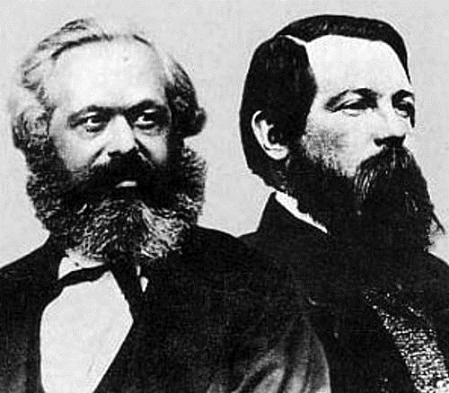

# Metodologia badań psychologicznych

# Podstawowe informacje

## Kontakt

Krzysztof Basiński

Zakład Badań nad Jakością Życia

Katedra Psychologii

ul. Tuwima 15, pokój 312

## Kontakt

krzysztof.basinski@gumed.edu.pl

kbas.gumed.edu.pl

k-basinski.github.io/mbp

## Podręczniki

## Podręczniki

## Podręczniki

## Źródła on-line

- Introduction to psychology – Charles Stangor (Google: „stangor introduction psychology pdf”)
- en.wikipedia.org

## Zaliczenie

- Egzamin (najpewniej termin "0" w pierwszym/drugim tyg. semestru letniego)
- W połowie pytania testowe, w połowie otwarte
- Ocena = 0.5 * egzamin + 0.25 * ćwiczenia w zimie + 0.25 * ćwiczenia w lecie

# Podstawy filozofii nauki

## Psychologia jako nauka
- Psycholog polega na badaniach empirycznych w wyciąganiu wniosków nt. zachowania ludzi
- Badania empiryczne oparte są na danych zbieranych i analizowanych w systematyczny sposób
- Zasady regulujące w jaki sposób naukowcy zbierają i analizują dane zbiorczo nazywane są metodą naukową

## Prawa i teorie
- Twierdzenia ogólne, stosowane do wszystkich sytuacji w danej dziedzinie, to prawa
- W fizyce np.:
    - Zasady dynamiki Newtona
    - Prawo powszechnego ciążenia
    - Ogólna i szczególna teoria względności
- W psychologii:
    - Prawo Webera-Fechnera
    - Prawo Yerksa-Dodsona
    - Prawo efektu (Thorndike)
    
    
## Prawa i teorie
- Teoria naukowa – zestaw reguł, które wyjaśniają i pozwalają przewidywać wiele (lecz nie wszystkie) zjawiska w jakiejś dziedzinie
- W psychologii np.:
    - Teoria społecznego uczenia się
    - Teoria rozwoju poznawczego Piageta
    - Teoria przeniesienia pobudzenia emocjonalnego
    - Teoria salutogenetyczna Antonovskiego
    - …i SETKI innych mniejszych/większych teorii

## Warunki dobrej teorii naukowej (za Stangorem ale nie tylko)
Dobra teoria naukowa powinna:

1. Być ogólna
2. Być oszczędna
3. Stymulować dalsze badania
4. Być falsyfikowalna

## Falsyfikacjonizm
- Karl Popper, Austria/UK, I poł. XXw.
- Teoria jest naukowa wtedy, gdy istnieje *hipotetyczna możliwość dowiedzenia jej nieprawdziwości*
- Np. teoria „wszystkie łabędzie są białe” jest falsyfikowalna.

## Teorie falsyfikowalne

## Teorie falsyfikowalne

## Teorie falsyfikowalne

## Teorie falsyfikowalne

## Teorie problematyczne

## Teorie problematyczne

## Teorie problematyczne

## Prcaca naukowa jako weryfikowanie hipotez
- Empirycznej weryfikacji teorii dokonuje się poprzez weryfikowanie hipotez wysnutych na jej podstawie
- Hipoteza – proponowane wyjaśnienie jakiegoś zjawiska, sformułowane na podstawie teorii naukowej i testowalne przy pomocy badań empirycznych
- Hipoteza najczęściej postuluje jakiś związek pomiędzy zmiennymi
- Jeśli hipotezy wysnute z teorii potwierdzane są w badaniach, to teoria jest dobrą teorią naukową…
- …ale…

## Nauka z perspektywy kurczaków czyli problem indukcji
- Kurczak co rano obserwuje jak hodowca przychodzi i wydaje jedzenie
- Na mocy indukcji kurczak stwierdza, iż prawdziwe jest zdanie „hodowca każdego dnia przychodzi wydać jedzenie”
- Problem – pewnego dnia hodowca przychodzi i ukręca łeb kurczakowi

## Nauka z perspektywy kurczaków czyli problem indukcji

- Inne przykłady:
    - Każdego dnia wschodzi słońce
    - Jeśli ktoś umiera, to nigdy nie jestem to ja.
- Czy można orzec o prawdziwości teorii na podstawie danych empirycznych, które ją potwierdzają?

## Inny sposób na poradzenie sobie z problemem indukcji
- To co otrzymujemy na drodze indukcji to nie dowód na prawdziwość teorii tylko jej uprawdopodobnienie
- Teorie naukowe w kategoriach probabilistycznych
- Problem filozoficzny (D.Hume) – nie ma logicznego uzasadnienia dla przewidywania przyszłości tylko na podstawie wydarzeń z przeszłości

## Jeszcze inny sposób na poradzenie sobie z problemem indukcji
- Nauka składa się z tzw. rozumowań abdukcyjnych
- Podział rozumowań:
    - Dedukcyjne – wnioskowanie o konkluzjach na podstawie logicznych przesłanek
        - Prawo sylogizmu - jeśli A->B i  B->C to A->C
        - np.: Wszyscy ludzie są śmiertelni. Elvis Presley jest człowiekiem. Elvis Presley jest śmiertelny.
    - Indukcyjne
    - Abdukcyjne – obserwujemy zjawisko i poszukujemy jego wyjaśnienia (rozumowanie post hoc)
    
    
## Rozumowania abdukcyjne
- W trakcie gry w bilard obserwujemy poruszającą się czarną bilę 
- Możemy założyć, że porusza się ona, ponieważ została uderzona przez białą bilę. Nie jest to zawsze prawdziwe założenie, ale pozwala nam orientować się w danym zjawisku
- Naukowcy formułują jedynie prawdopodobne hipotezy na temat świata 
- Hipotez może być wiele – problem brzytwy Ockhama

## Brzytwa Ockhama
- **Spośród konkurencyjnych hipotez, wybrana powinna być ta z najmniejszą ilością założeń**
- Przykład: w czasach Kopernika obserwacje ciał niebieskich można było wytłumaczyć zarówno modelem helio-, jak i geocentrycznym. Model geocentryczny wymagał jednak bardzo wielu założeń a heliocentryczny tylko siedmiu
- Często Brzytwa jest nadinterpretowana – *„najprostsze wyjaśnienie jest najlepsze”* (!)
- A.Einstein: *„wszystko powinno być opisane tak prosto jak to tylko możliwe… ale nie prościej!”*

## Rozwój nauki - paradygmaty (Thomas Kuhn)
- Thomas Samuel Kuhn (1922-1996), amerykański fizyk, historyk, filozof nauki, autor książki The Structure of Scientific Revolutions (1962)
- Wcześniej sądzono, że rozwój nauki przebiega poprzez akumulację wiedzy
- Kuhn dowodzi, że w nauce dochodzi do rewolucji, zwanych zmianami paradygmatów (paradigm shift)

## Rozwój nauki - paradygmaty (Thomas Kuhn)
Paradygmat to ogólnie uznawany (w danym momencie) model problemów i rozwiązań, który dla grupy naukowców definiuje:

- Co powinno być badane
- Jakiego rodzaju pytania mogą być zadawane
- Jaka jest struktura takich pytań
- Jaka jest podstawowa teoria w danej dziedzinie
- Jak należy interpretować wyniki
- W jaki sposób i jakimi metodami przeprowadzać badania

## Zmiany paradygmatów w historii
- Przewrót kopernikański
- Principia Mathematica Newtona i rozwój fizyki
- Szczególna i ogólna teoria względności Einsteina
- Rozwój mechaniki kwantowej
- Mniejsze (?) zmiany na naszych oczach:
    - Opisanie genomu ludzkiego
    - fMRI i inne techniki neuroobrazowania – rozwój tzw. cognitive neuroscience
    - Odkrycie fal grawitacyjnych
    - CRISPR Cas9

## Problem związku obserwacji z teorią - ile gwiazd na obrazku?

## Związek obserwacji z terorią
- Gwiazd na obrazku widać 5. Jednak wg. teorii względności Einsteina są to de facto tylko dwa obiekty!
- Nawet w obrębie jednej dziedziny nauki obserwacje mogą się różnić w zależności od przyjętego modelu teoretycznego. Np. obserwacja zachowania w psychologii:

## Związek obserwacji z terorią
- w kontekście procesów warunkowania – behawioryzm
- w kontekście przekonań, myśli i sądów jednostki – psychologia poznawcza
- w kontekście wpływu społecznego – psychologia społeczna
- w kontekście nieświadomych popędów i mechanizmów obronnych - psychoanaliza

## Wartości w nauce
- Nie ma zgody odnośnie celów, jakie powinny spełniać badania naukowe
- Czy nauka powinna skupić się na poznaniu prawdy absolutnej, czy też są rzeczy, których nauka nie może poznać?

## Wartości w nauce
- *Realizm naukowy* – nauka pokazuje prawdę, teorie naukowe są albo prawdziwe, albo częściowo prawdziwe albo błędne
- *Antyrealizm* – nauka nie pokazuje prawdy, zwłaszcza o rzeczach trudno obserwowalnych (problemy mechaniki kwantowej)
- *Instrumentalizm naukowy* – nauka nie powinna się skupiać na poznaniu prawdy, tylko na użytecznych teoriach, które pozwalają przewidywać  przyszłość i prowadzą do postępu technologicznego

## Nauka vs. pseudonauka
- Niektórzy ludzie propagują treści, które na pierwszy rzut oka *wydają się* być naukowe, ale takie nie są
- Nie są, bo np. nie spełniają warunku falsyfikowalności albo którejś z cech nauki
- Jest wiele pseudonaukowych teorii ocierających się o psychologię:
    - ESP
    - Biorytmy
    - Astrologia
    - Numerologia
    - Terapie pseudonaukowe
    

## Długa lista dziwacznych terapii psychologicznych (za Singer i Lalich, *Crazy Therapies*, 1996)
- Leonard Orr opracował teorię oddychania energią. Według niego, jeśli nauczysz się oddychać właściwie, możesz *wydechnąć* (breathe away) choroby i ból.
- Marguerite Sechehaye i John Rosen praktykują terapię regresji i "reparentingu". Terapeuta staje się zastępczym rodzicem pacjenta, aby naprawić szkody które wyrządzili jego prawdziwi rodzice.

## Długa lista dziwacznych terapii psychologicznych

- Jacqui Shiff uważa, że pacjent musi chodzić w pieluchach, ssać kciuka i pić z butelki aby wyzdrowieć.
- Sondra Ray i Bob Mandel uważają, że twoje problemy wynikają ze sposobu, w jaki się urodziłeś. Pomogą ci "urodzić się na nowo", tym razem właściwie.

## Długa lista dziwacznych terapii psychologicznych
- John Fuller, Bruce Goldberg, Brian Weiss, Edith Fiore, Richard Boylan, David Jacobs, Budd Hopkins i  John Mack używają hipnozy, aby odkryć dawne (lub przyszłe!) przypadki w życiu pacjenta, w których został porwany przez kosmitów. Ma to pomóc...
- John Bradshaw uważa, że każdy ma swoje *wewnętrzne dziecko*, dla którego musi być dobry aby pozostać w zdrowiu psychicznym

## www.skepdic.com

## Z naszego podwórka - Bałtycki Instytut Psychologii

## Nauka a zdrowy rozsądek
- Czy koniecznie musimy podchodzić do psychologii naukowo?
- Czy nie wystarczy zdrowy rozsądek?
- Przykłady zdroworozsądkowych *teorii psychologicznych*:
    - Człowiek jest mniej agresywny jeśli się "wyładuje"
    - Ludzie nie przyznają się do przestępstwa, którego nie popełnili (chyba że na skutek tortur)
    - Przeciwieństwa się przyciągają
    - Niektórzy ludzie są "humanistami", inni zaś to "umysły ścisłe"
    

## Dlaczego zdrowy rozsądek zawodzi?
- Brak sceptycyzmu naukowego
- Jeśli wiele osób (w tym ekspertów) podziela jakiś pogląd, ten pogląd na pewno jest prawdziwy (*confirmation bias*)
- Brak tolerancji dla niewiedzy (nie wiemy jak działa paracetamol!)

  
## Mity w psychologii (z którymi musicie walczyć!)
- Ludzie używają tylko 10% swojego mózgu
- Niektórzy ludzie są lewo-półkulowi a inni prawo
- Przekazy podprogowe mogą zmusić człowieka do kupna produktu
- Hipnoza pozwala przypomnieć sobie zapomniane wspomnienia
- Wrzody żołądka spowodowane są przede wszystkim stresem
- Najlepszym źródłem wiedzy o leczeniu zaburzeń psychicznych jest doświadczenie klinicysty

## Nauka a praca kliniczna
- Zaburzenia psychiczne są częścią świata empirycznego, dlatego *można* je badać empirycznie
- Skuteczność terapii psychologicznych również można badać empirycznie (w paradygmacie badań klinicznych)
- Środowisko jest podzielone odnośnie roli nauki w terapii psychologicznej

