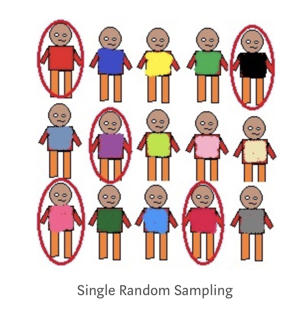
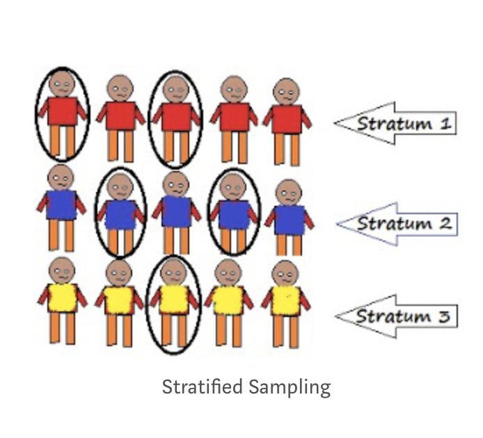

## Zmienne

## Zmienne

- Zmienna -  jakakolwiek własność lub cecha, która przyjmuje różne wartości u różnych ludzi, w różnych sytuacjach etc.
- Przykłady:
    - Wiek
    - Płeć
    - Nastrój
    - Agresywność
    - Inteligencja
    - Neurotyzm

## Operacjonalizacja zmiennej

- Nie wszystkie pojęcia (zmienne konceptualne) można wprost badać empirycznie
- Przykłady - inteligencja, osobowość, poczucie kontroli
- Operacjonalizacja to definiowanie zmiennej przez pryzmat obiektywnych, empirycznych wskaźników (np. wynik testu na inteligencję)
- Definicja operacyjna: np. inteligencja = wynik testu Wechslera

## Typy zmiennych

- Zmienne jakościowe
- Zmienne ilościowe

## Typy zmiennych (skal pomiarowych)

- Zmienne kategorialne (*categorial*)
- Zmienne ciągłe (*continous*)

## Zmienne kategorialne: typy

- Zmienna nominalna (*nominal*) – dwie lub więcej kategorii, jednak kategorie są **nieuporządkowane**
- Zmienna dychotomiczna (*dichotomous*) – specjalny rodzaj nominalnej, przybiera tylko **dwie**, przeciwstawne kategorie
- Zmienna porządkowa (*ordinal*)– kategorie można uporządkować, jednak nie można porównywać ich ze sobą

## Zmienne ciągłe: typy

- Zmienna przedziałowa (*interval*) – zmienna przybiera wymierne wartości, które można porównywać
- Zmienna ilorazowa, stosunkowa (*ratio*) – zmienna przedziałowa z punktem zerowym (można powiedzieć, że czegoś jest np. „dwa razy więcej”)

## Hipotezy

## Ogólny model pracy naukowej

## Hipotezy

- Teorie są najczęściej "za duże", żeby je w całości weryfikować za pomocą pojedynczych badań
- Hipoteza badawcza - konkretna, falsyfikowalna predykcja na temat związku pomiędzy dwiema lub więcej *zmiennymi*
- Hipoteza zakłada *związek* pomiędzy zmiennymi i najczęściej mówi o *kierunku* tego związku
- Najprostsze hipotezy łączą dwie zmienne, ale może być więcej

## Przykłady hipotez badawczych

#. Neurotyzm wiąże się z większym ryzykiem psychopatologii
#. Wysoki poziom lęku wiąże się z krótszym zwlekaniem z podjęciem leczenia onkologicznego
#. Słuchanie muzyki *zmniejsza* natężenie odczuwanego bólu
#. Słuchanie muzyki *zwiększa* natężenie odczuwanego bólu

## Hipotezy kierunkowe

- Hipoteza kierunkowa to taka, która zakłada *kierunek zależności* między dwiema zmiennymi
- W takiej hipotezie mamy zmienną / zmienne niezależne (*predyktory*) i zmienną zależną (*outcome*)
- Zmienna niezależna **wyjaśnia zmienność** zmiennej zależnej

## Skąd wziąć dobre pytania badawcze/hipotezy?

- Z *prawdziwego życia*
- Inspiracją mogą być problemy praktyczne
- Można weryfikować twierdzenia "zdroworozskądkowe"
- Z literatury

## Parę pytań, które warto sobie zadać

- Jakie są możliwe przyczyny jakiegoś zjawiska (cechy, zachowania)?
- Jakie są możliwe konsekwencje jakiegoś zjawiska?
- Czy zjawisko dotyczy wszystkich ludzi, czy tylko niektórych?
- Czy zjawisko występuje zawsze czy tylko w określonych sytuacjach?

## Czym charakteryzują się dobre pytania badawcze

- Są **weryfikowalne**
- Są interesujące
- Są ważne dla świata

## Populacja, próba, metody doboru

## Populacja i próba

- *Populacja* - ogół osób, do których odnosi się dana teoria psychologiczna (np. populacja wszystkich ludzi, populacja kobiet, populacja niemowląt)
- Najczęściej nie możemy zbadać całej populacji ze względów praktycznych
- Badamy tylko określona cześć populacji - *próbę*
- Jest wiele różnych metod *doboru próby*

## Metody doboru próby

- Probabilistyczne
    - Dobór prosty losowy (_simple random sampling_)
    - Dobór warstwowy (_stratified sampling_)
    - Dobór systematyczny (_systematic sampling_)
- Nieprobabilistyczne
    - Dobór przypadkowy (_convenience sampling_)
    - Dobór kwotowy (_quota sampling_)
    - Kula śniegowa (_snowball sampling_)
- I wiele, wiele innych...

## Obrazki z towardsdatascience.com

## Dobór prosty, losowy

- Każda osoba z populacji ma równą szansę dostania się do próby
- Potrzebny **operat losowania**

## Dobór prosty, losowy

## Dobór warstwowy

- Dobór pod względem jakiejś ważnej charakterystyki
- Najpierw trzeba wyłonić ważne charakterystyki, co bywa trudne
- W obrębie warstw stosujemy dobór prosty losowy

## Dobór warstwowy

## Dobór systematyczny

- Jeśli dysponujemy populacją uszeregowaną, możemy wybrać co n-tą osobę z szeregu
- Często w badaniach medycznych (np. _co trzecia osoba rejestrująca się do onkologa w WCO_)
- Metoda dobra jeśli tylko lista nie zawiera w sobie ukrytego porządku

## Dobór systematyczny

## Dobór przypadkowy

- Kto się nawinie
- Najczęstszy przypadek w badaniach psychologicznych
- Może nie stanowić problemu, może stanowić ogromny problem

## Dobór kwotowy

- Zakładamy liczebności osób o zadanych cechach obecne w populacji
- Rekrutujemy badanych aż osiągniemy te liczebności

## Kula śniegowa

- Rekrutujemy badanego, po czym każemy mu przyprowadzić ludzi podobnych do niego
- Zupełnie niepoprawne metodologicznie, ale czasem jest to jedyna opcja, jeśli badamy bardzo specyficzne populacje/bardzo rzadkie cechy

## Próba a populacja

- Skąd wiemy, że zależność wykryta w próbie jest obecna w populacji? Nawet jeśli mamy najlepszy, najbardziej reprezentatywny dobór próby.
- Nie wiemy
- Możemy przypuszczać z określonym *prawdopodobieństwem*
- Do określenia tego prawdopodobieństwa potrzebujemy testów statystycznych

