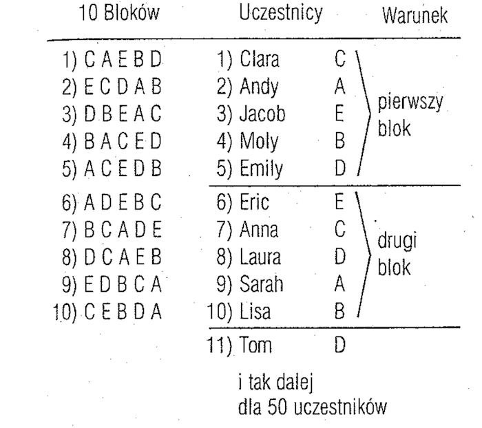
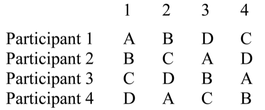
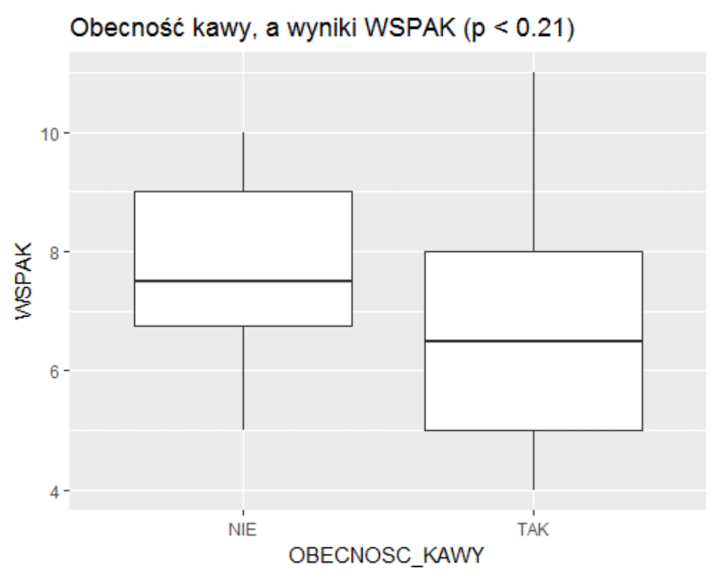

### Eksperymenty

### Co to jest eksperyment?

- W eksperymencie **manipuluje się** zmienną niezależną
- W eksperymencie minimalizuje się wpływ zmiennych zakłócających 
- Eksperymenty robi się po to, aby odpowiedzieć na pytanie o **zależność przyczynową** pomiędzy dwoma zmiennymi

### Dechy dobrego eksperymentu

- Trafność wewnętrzna
- Trafność zewnętrzna
- Rzetelność
- Wrażliwość

### Trafność wewnętrzna eksperymentu

- Wysoka **trafność wewnętrzna** jest wtedy, gdy zmiana zmiennej zależnej rzeczywiście była spowodowana **manipulacją eksperymentalną** a nie działaniem jakiejś zmiennej zakłócającej

### Warunki trafności wewnętrznej

- Współzmienność
- Porządek czasowy
- Eliminacja innych wyjaśnień poprzez:
    - Utrzymywanie stałych warunków
    - Równoważenie (np. cech osób badanych)

### Trafność zewnętrzna eksperymentu

- Inaczej: trafność ekologiczna, środowiskowa
- Czy sytuacja eksperymentalna dobrze oddaje sytuacje z prawdziwego życia?
- Często problem w badaniach psychologicznych:
    - wykonywanie testu matematycznego w stroju kąpielowym (Fredrickson et al., 1998)
    - eksperymentalna stymulacja bólowa a "prawdziwy" ból
    
### Rzetelność i wrażliwość eksperymentów

- Rzetelność – wielokrotne powtórzenia prowadzą do tych samych wyników
- Wrażliwość – eksperyment pozwala wykryć nawet niewielki wpływ zmiennej niezależnej

### Źródła błędów w badaniach eksperymentalnych

- Utrata osób badanych:
    - Mechaniczna (bo coś się popsuło, bo ktoś coś źle zrobił)
    - Tendencyjna (systematyczna, mogąca mieć wpływ na badaną zmienną)
- Oczekiwania osób badanych (ukryte wymagania sytuacji eksperymentalnej)
- Oczekiwania badacza (efekt badacza)

### Jak radzić sobie z biasem? Przykład RCT

- RCT - _randomized controlled trials_
- W RCT dąży się do tzw. podwójnego zaślepienia (*double-blind trial*)
- Badany nie wie w jakiej jest grupie
- Eksperymentator nie wie w jakiej badany jest grupie

### Proste plany eksperymentalne

- Plany grup niezależnych
- Plany z powtarzanymi pomiarami

### Plan grup niezależnych

- Dwie (lub więcej) grupy osób badanych, osobno dla każdego poziomu manipulacji zmiennej niezależnej
- Grupy różnią się od siebie **tylko pod względem manipulacji eksperymentalnej**
- Często występuje grupa kontrolna (brak manipulacji)

### Plan grup niezależnych

- Jeżeli grupy badanych są podobne do siebie pod względem wszystkich ważnych cech na początku eksperymentu…
- …to manipulacja eksperymentalna spowodowała zmianę zmiennej zależnej
- Każdy członek populacji ma taką samą szansę znalezienia się w każdej z grup

### Randomizacja

### Przykłady (z badań waszych kolegów i koleżanek)

- Czy wypicie rano kawy poprawia pamięć krótkotrwałą?
- Czy presja czasu wpływa na koncentrację?
- Czy jesteśmy bardziej spostrzegawczy w trakcie słuchania muzyki instrumentalnej czy wokalnej?

### Plan z powtarzanymi pomiarami

- Każdy badany otrzymuje wszystkie manipulacje eksperymentalne
- Badany sam dla siebie jest kontrolą
    - Na ogół jest wygodniejszy, wymaga mniej osób badanych i jest bardziej wrażliwy niż plan grup niezależnych
- ...ALE jest jeden problem

### Efekt wprawy

- Sam fakt pomiaru danej zmiennej wpływa na osoby badane
- Przy powtarzanym pomiarze mamy zachwiany warunek utrzymywania stałych warunków eksperymentalnych
- Efektu wprawy nie da się wykluczyć, można go tylko zrównoważyć

### Efekt wprawy

- Pełny plan z powtarzanymi pomiarami: każdy badany bierze udział w każdym warunku kilka razy w różnej kolejności
- Niepełny plan z powtarzanymi pomiarami: różni badani mają różną kolejność warunków eksperymentalnych

### Równoważenie efektu wprawy - plan pełny

- Randomizacja w blokach:
    - Identycznie jak dla planu grup randomizowanych
    - Bardzo skuteczna procedura
    - Wymaga powtórzenia każdej „kolejności” kilka razy – wiele prób eksperymentalnych

### Równoważenie efektu wprawy - plan pełny

- Procedura ABBA:
    - Dla dwóch warunków – najpierw prezentujemy AB, potem BA
    - Dla trzech – najpierw ABC, potem CBA
    - Skuteczna, o ile efekt wprawy jest liniowy 
    - Pojawia się efekt antycypacji

### Równoważenie efektu wprawy - plan niepełny

- Różne kolejności warunków eksperymentalnych u różnych osób
- Każdy warunek eksperymentalny powinien pojawić się jednakową ilość razy w każdej możliwej kolejności
- Wszystkie możliwe kolejności:
    - Wszystkie permutacje zbioru N-elementowego – N!
    - Każda permutacja dla równej liczby osób badanych

### Równoważenie efektu wprawy - plan niepełny

- Wybrane kolejności:
    - Kwadrat łaciński
    - Rotacje losowej kolejności
    

### Kwadraty łacińskie

### Kwadraty łacińskie

### Metoda rotacji

Wybieramy losowo kolejność i rotujemy ją o jedną pozycję w przód tyle razy, ile mamy elementów, np.:

1. ACBED
2. CBEDA
3. BEDAC
4. EDACB
4. DACBE

### Analiza wyników w badaniach eksperymentalnych

---

---

