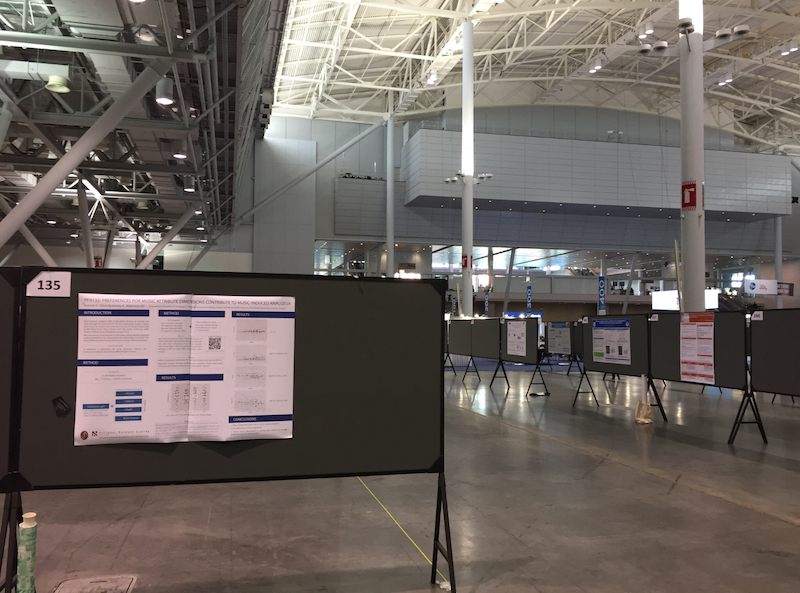

# Komunikowanie wyników badań naukowych

## Sposoby komunikacji w nauce (dla naukowców)

- **artykuły w czasopismach naukowych**
- książki/monografie
- konferencje

## Artykuły w czasopismach naukowych

- Raporty z badań
- Krótkie raporty z badań
- Systematyczne przeglądy/metaanalizy
- Komentarze
- Editoriale
- ...i wiele innych, zależnie od czasopisma

## Cykl publikacyjny

1. Złożenie manuskryptu
2. Redaktor kwalifikuje do recenzji
3. Recenzja -> przyjęcie / odrzucenie / poprawki
4. Ew. ponowna recenzja
5. Publikacja albo odrzucenie

## Wzorcowy model recenzji

- _Double blind peer review_

## Modele publikacyjne

- Model tradycyjny
- Open access

## Model tradycyjny

- Ograniczony dostęp do artykułów
- Płatny egzemplarz/dostęp do czasopisma
- Najczęściej dostęp kupują biblioteki
- Czasem dostęp dla członków towarzystw naukowych

## Model open access

- Nieograniczony dostęp do artykułów
- Autor płaci za publikację
- Najczęściej za pieniądze z grantów
- Problemy z "drapieżnością" niektórych wydawców

## Dobre czasopisma open access

- Scientific Reports
- PLOS One
- Frontiers in Psychology

## Wskaźniki bibliometryczne

- Impact Factor
- Hirsch Index

## Książki / monografie

- Książka jest naukowa jeśli jest recenzowana
- Standardem są dwie recenzje dokonane przez autorytety w dziedzinie

## Konferencje naukowe - po co są?

- Prezentowanie wyników wstępnych
- Dyskusje
- Nawiązywanie kontaktów

## Co można robić na konferencjach naukowych?

- Wykłady plenarne
- Seminaria
- Sesje plakatowe

## Co jeszcze można robić na konferencjach?

- Bankiety, imprezy
- Wystawcy
- Warsztaty
- Networking

## Konferencje naukowe

## Konferencje naukowe

